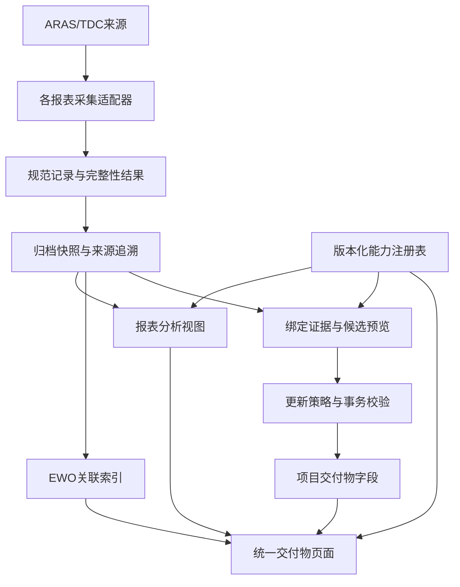

# EWO、PAA、NCR 交付物映射架构方案

日期：2026-09-14。状态：提案，待评审；本轮只分析当前代码及用户截图，未修改产品逻辑。此前 SOR 修复与复测包保持有效。

## 1. 架构结论

建议做渐进式局部重构：统一交付物页面入口、能力描述和数据视图，保留各来源采集适配器及业务规则。不要把 EWO 的字段写回表单原样复制给 PAA/NCR，也不要把 EWO 降级成只读归档。

截图比较的是两种对象：EWO 是项目交付物，带更新策略、绑定与字段写回；PAA/NCR 是归档任务的报表视图，带过滤、快照、趋势或成本分析。其视觉不一致既有合理业务差异，也有实现层面的概念混用。

## 2. 当前实现证据

| 事实 | 代码依据 | 含义 |
| --- | --- | --- |
| EWO VPI-T2-D3 支持同步且 aggregate=true | core/project_status_contracts.py:70 附近 | 当前主合同是集合聚合，不是必填唯一记录 |
| EWO项目详情调用 loadDeliverablePolicy，归档详情有独立渲染器 | web/static/app.js:5729、5738 | 同样叫交付物，实际页面对象不同 |
| PAA/NCR 不在项目状态来源能力表中；ArasProjectStatusConnector 明确仅允许 ewo | core/project_status_contracts.py；services/project_status_connectors.py:316 附近 | 能抓报表不等于能自动更新项目交付物字段 |
| EWO编辑器无条件展示外部稳定键及“唯一外部记录”说明，但校验排除聚合模式的必填要求 | web/static/app.js:1297、1492 附近 | 用户看到的模型与后端执行规则不一致 |
| 候选为1条时可映射负责人/日期；多条时只聚合备注 | services/project_status_records.py:217 | 结果基数变化会改变允许写入的字段，需要显式表达 |
| PAA/NCR有EWO关联列与过滤规则 | services/deliverable_form_analysis.py:1469 附近 | 已有报表关联线索，不能等同于已建立业务外键 |
| EWO、PAA阶段集和超期规则不同，NCR进度按审批节点，NCR明细无阶段集 | services/deliverable_form_analysis.py:57、112、135 附近 | 统一展示框架必须保留来源专属语义 |

地图检查已通过。截图中的空表不能证明采集失败；可能无快照或无匹配记录。本轮没有读取生产数据库，因此不判断某一现有绑定是否正确，也不把截图记录当作已验证的真实关联。

## 3. 必须拆开的四个概念

1. 数据范围：查询哪些车型、部门、日期、单号的记录；它决定集合，不决定字段写回。
2. 业务关联：PAA/NCR记录与哪些EWO相关；依据来源明确字段，不从标题或车型猜测。
3. 字段映射：来源哪个规范字段更新项目交付物的负责人、计划日期、备注等；必须经过证据和更新策略。
4. 统计规则：怎样计数、聚合、计算阶段和超期；不能由任意字段映射推导。

页面应分别称为“数据范围”“关联EWO”“项目字段更新”“统计口径”，避免全部称为映射。

## 4. 目标组件与边界

保持单体分层，不增加微服务。core 管合同、身份与持久化；services 管来源适配、标准化、关联、分析与更新；web 只负责组合与交互。继续复用 ArchiveStore、现有同步runner、mapping discovery与事务更新服务。

同一规范化结果可供分析与证据消费，但交互查询默认是临时预览，不能覆盖后台快照或自动成为可授权写回证据。只有符合来源、范围、完整性、时效要求的结果才能进入证据流程。

### 能力注册表

增加来源描述层，与具体项目交付物实例分离。建议字段：reportKey、recordGrain、identityFields、queryFields、stageModel、overdueModel、relationFields、analysisFeatures、bindingModes、writableFields、contractVersion。

- reportKey 用 source+report 区分，例如 aras:ewo、aras:paa、aras:ncr_progress、aras:ncr_detail；避免目前仅按 aras 路由后再默认ewo。
- 下游功能严格由能力驱动；缺能力时禁用并说明原因，删除前端“未知来源默认EWO”的回退。
- 项目实例引用 reportKey 和选定范围；现有VPI ID、archive jobKey保留为兼容标识，不强制互相转换。
- 初期可在当前能力表外增加薄描述层并校验一致性，随后迁移消费者到单一来源，不并行维护两套长期真相。

### 规范记录与身份

记录保留 source、reportKey、sourceRecordId、businessNumber、project/department、stage/status、相关日期、relatedEwoNumbers、snapshotId、sourceSheet/sourceRow、contractVersion。

不得强迫所有来源共享相同字段或相同ID：
- EWO/PAA 是流程视图，业务单号可供展示与关联；源记录ID/版本用于区分修订。业务单号是否可唯一授权须由来源合同验证。
- NCR进度与NCR明细是两种粒度。明细必须保留工作表及零件/明细身份，不能只按NCR号去重；成本不能因关联多个EWO而重复累计。
- 找不到稳定身份的行可供只读展示并标记质量问题，但不能自动更新项目字段。

## 5. EWO绑定语义修正

显式区分 single_record 和 record_set。兼容现有aggregate标记，但新API与UI使用明确模式。

| 模式 | 范围与身份 | 自动写入建议 |
| --- | --- | --- |
| 单记录绑定 | 稳定键及唯一匹配证据；匹配0条或多条均阻止写回 | 经字段合同确认的负责人、计划日期、备注 |
| 集合绑定 | 保存明确筛选范围；展示数量、范围签名、完整性和证据时间；不要求唯一外部键 | 允许批准的集合备注/统计；负责人、日期默认手工 |

集合在某次恰好只返回1条时，也不应自动改变字段所有权。若确需允许此行为，必须作为明确策略并在1→多时提示；推荐新配置采用固定模式，不随记录数隐式变化。

未开始/进行中/完成/超期等项目状态，需独立业务聚合政策；不能仅凭某条流程CLOSE或集合变空就自动标完成。空集合、部分分页、缺身份、过期证据、签名不匹配均不可授权清空或完成。

## 6. PAA/NCR接入策略

第一阶段统一数据范围、快照状态与关联展示，不开放项目字段自动更新。能力明确显示“支持报表同步；尚未开放项目字段写回”，避免误报整个功能只能手工。

第二阶段建立只读关联索引：优先使用报表明确的EWO列，保留原始关联值与规范化值；多值分隔须按实际样本合同解析。允许0/1/N关系，展示未关联、无法解析、目标未收录和多关联，不强制一对一，不跨来源盲目去前缀/截断。

第三阶段在身份、版本、分页、负责人/日期来源均有证据后，逐报表开放绑定能力。NCR成本继续是分析指标，不自动写入项目计划日期或完成状态；PAA的负责人和预计日期不得直接套用EWO列名。

## 7. 页面方案

统一详情页外壳：数据来源与时间 → 数据范围 → 最新快照/临时查询 → 统计与明细 → 关联记录 → 更新设置。

- EWO集合模式隐藏外部稳定键；显示命中数量、范围、完整性及证据状态。单记录模式才展示稳定键。
- “更新设置”拆为“数据刷新/归档”和“项目字段更新”。前者设置采集与计划，后者只对已支持的项目实例开放。
- 负责人/日期使用来源字段选择及语义提示，显示允许写入的字段；聚合模式不提供无效勾选。
- 保留PAA阶段、NCR审批节点、NCR成本专属面板；不存在的能力不渲染通用空控件。
- EWO详情可查看关联PAA/NCR；其它报告可跳转对应EWO。没有唯一目标时展示候选，不跳错记录。
- 空数据区分：未采集、采集失败、成功但无匹配、部分数据；保留上次成功快照并标注新鲜度。

## 8. 数据迁移与接口演进

1. 先新增能力描述与页面适配层，保持现有接口、archive job与binding ID不变。
2. 新模式可由legacy aggregate推导用于展示；读取兼容，保存时显式记录模式与合同版本。
3. 有效旧绑定继续按旧语义运行，不能在升级时悄悄改变字段所有权。需要切到新集合语义的绑定先预览差异，确认后重新验证证据再启用。
4. 合同版本变化使授权证据失效，历史仍可审计；不得把旧映射观测直接迁为新模式的稳定证据。
5. 关联索引由现有快照重建，标明覆盖范围；缓存可删除重建，不能成为唯一真相。
6. 分批启用新页面/模式，保留旧读路径及旧历史；回滚关闭新写入，保留新增审计记录，不做破坏性数据回退。

## 9. 实施阶段与验收

| 阶段 | 交付 | 验收 |
| --- | --- | --- |
| A：修正当前语义 | 聚合UI、明确刷新/写回区分、未知能力禁用 | EWO集合不再要求唯一外部键；保存/发现/执行模式一致；PAA/NCR不误获写权限 |
| B：统一描述与页面 | 注册表、通用外壳、专属分析组件 | 现有阶段/超期/成本规则与快照保持；旧路由可用；无EWO默认回退 |
| C：只读关系 | EWO与PAA/NCR关联索引和跳转 | 0/1/N关系、缺目标、版本、双工作表、关联后成本不重复 |
| D：逐来源写回 | 经验证的PAA/NCR连接器与字段政策 | 身份/完整性/签名/时效/并发/幂等全部通过；未经支持来源拒绝 |

重点回归：集合1→多→0不改变字段所有权；显式模式切换重新取证；预览与执行同查询同归一化；跨页缺失/重复拒绝；配置变更期间响应不能授权旧配置；手工修改及锁定保持；跨来源同单号不混淆；交互查询不污染归档趋势。

阶段A/B无需新HAR，可按现有代码完成。阶段C需脱敏的真实关联字段样本；阶段D若缺少对应分页/身份/版本/导出合同，才定向补PAA/NCR HAR，不必重录EWO全流程。生产凭据不进入方案、样本或测试。

## 10. 待确认的业务决策

建议默认目标：EWO作为关联入口，PAA/NCR先保持只读分析；项目集合的负责人和日期保留手工；关联缺失只提示不自动推断。若产品目标是PAA/NCR也直接驱动项目字段，需要先确认对应项目交付物实例以及每个字段的业务所有权，再进入阶段D。

本方案不要求现在改变现有部署；下一步是评审阶段A/B范围，再制定实施计划。未执行代码修复、数据库迁移、提交或发布。
