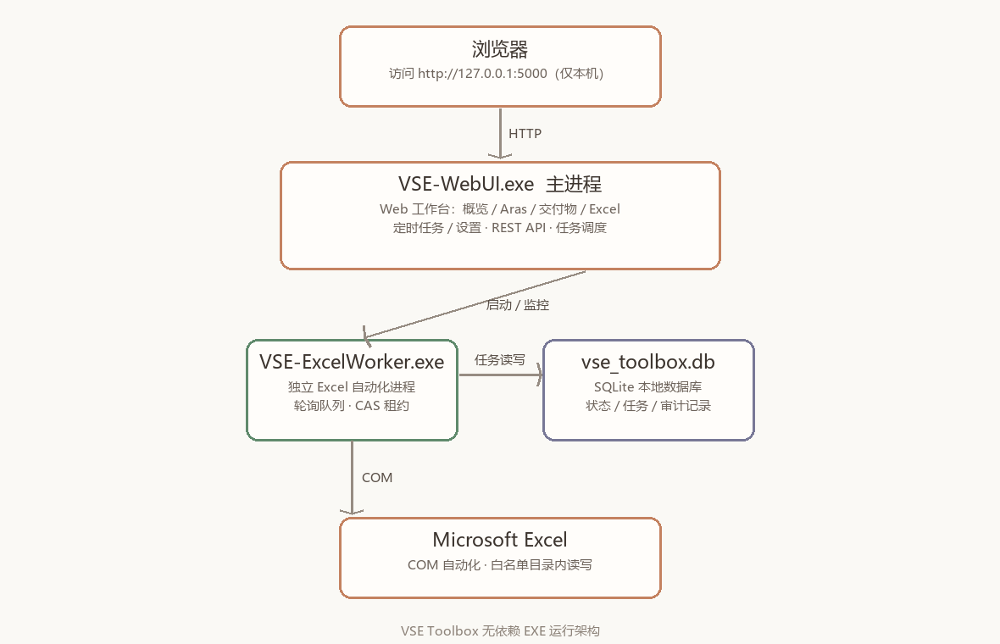
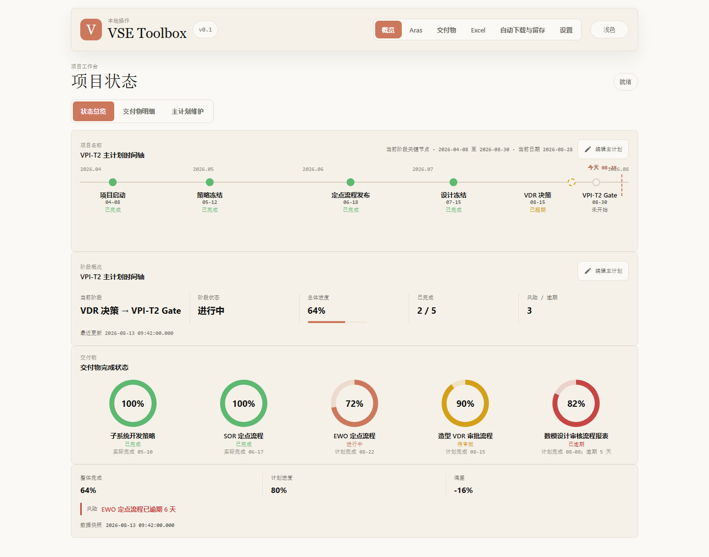
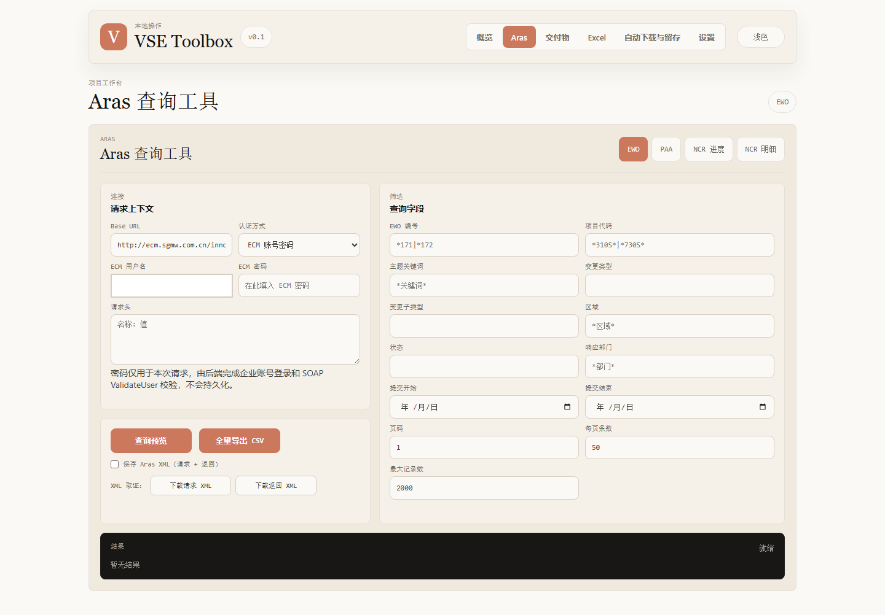
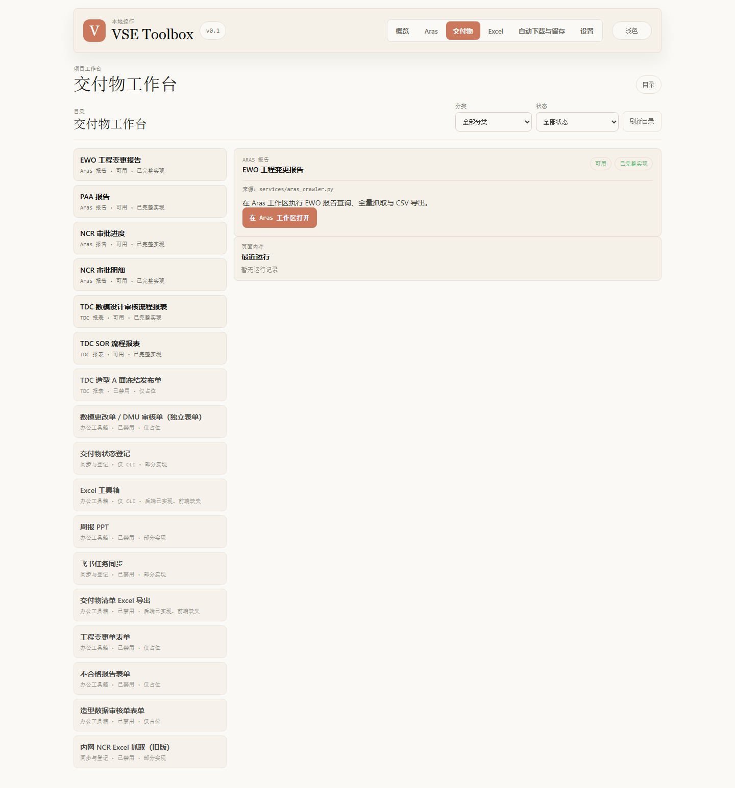
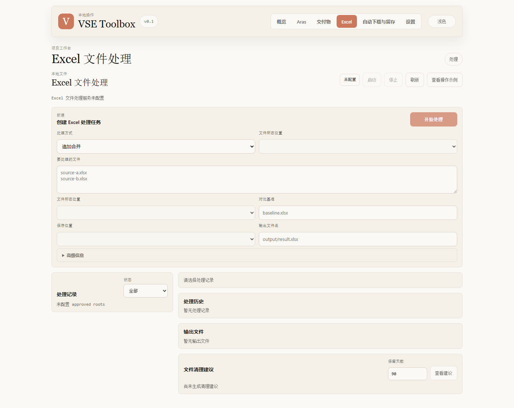
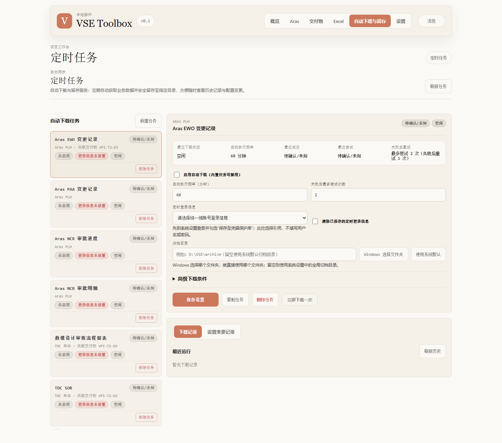
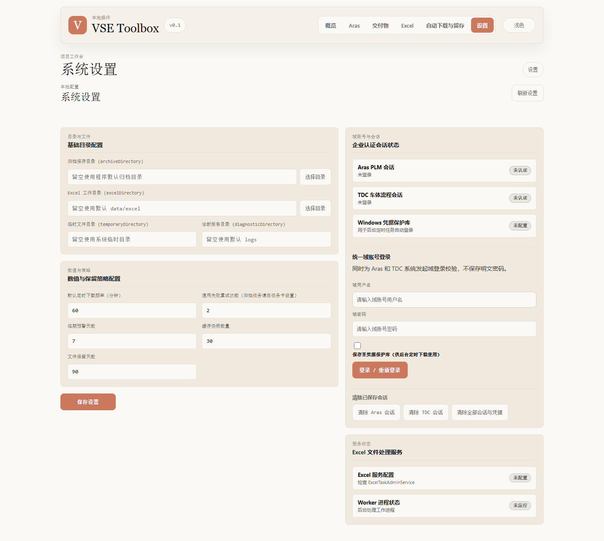
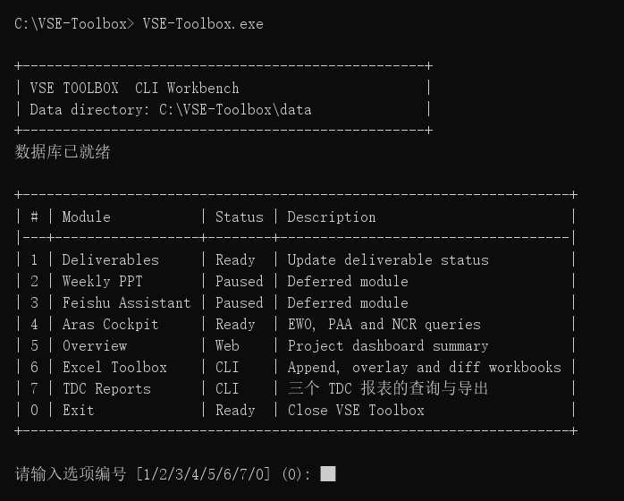

# VSE Toolbox 无依赖 EXE 使用说明

> 适用对象：`VSE-WebUI.exe` + `VSE-ExcelWorker.exe`（零依赖独立可执行程序）。
> 无需安装 Python、pip 或任何第三方库，解压即用。本文全部截图取自实际运行的程序界面。

---

## 1. 这是什么

VSE Toolbox 是一套**汽车行业项目管理自动化工具箱**，覆盖项目状态总览、Aras（PLM）报表抓取、
TDC 报表导出、交付物目录、Excel 文件批处理与定时自动下载归档。

“无依赖 EXE”指使用 PyInstaller 打包的独立可执行文件：内部已内嵌 Python 3.12 运行时与全部
依赖库，目标电脑**不需要配置任何开发环境**，普通用户权限即可运行。

## 2. 运行架构

推荐以「Web 工作台」方式使用：双击 `VSE-WebUI.exe` 后，用浏览器操作全部功能；
涉及 Excel 真实读写时，主进程会自动调起同目录下的 `VSE-ExcelWorker.exe` 独立完成，
两者物理隔离，Excel 崩溃不影响 Web 服务。



## 3. 交付物清单

最新构建位于 `dist/VSE-WebUI-deliverable-status-20260828/`（2026-08-28，本文截图即取自该版本）：

| 文件 | 作用 | 是否必需 |
|---|---|---|
| `VSE-WebUI.exe` | Web 工作台主进程（仪表盘、Aras、TDC、定时任务、设置） | 必需 |
| `VSE-ExcelWorker.exe` | Excel 自动化工作进程（真实 Office COM / xlwings 执行） | 使用 Excel 功能时必需 |
| `SHA256SUMS.txt` | 文件校验值清单 | 建议保留 |

**部署要求**：两个 exe 必须放在**同一个目录**（例如 `D:\VSE-Toolbox\`），主进程按
“同目录查找”规则拉起 Worker。把文件复制到任意可写目录即可，不需要安装步骤。

**完整性校验**（可选，PowerShell）：

```powershell
cd D:\VSE-Toolbox
Get-FileHash -Algorithm SHA256 .\VSE-WebUI.exe, .\VSE-ExcelWorker.exe
# 结果与随包的 SHA256SUMS.txt 逐条比对
```

## 4. 运行环境要求

| 项目 | 要求 |
|---|---|
| 操作系统 | Windows 10 / 11 / Server 2016+（64 位） |
| 用户权限 | 普通用户即可；需对 exe 所在目录有**写入权限**（数据存放在此处） |
| Office | 仅 Excel 文件处理功能需要已激活的 Microsoft Excel（2016/2019/2021/365） |
| 网络 | 本机 `127.0.0.1` 回环必须可用；使用 Aras / TDC 抓取时需能连通对应企业内网 |

> **数据放在哪？** 程序以“exe 所在目录”为根目录：数据库为 `<exe目录>\data\vse_toolbox.db`，
> 日志与输出文件也在 `data\` 下。若该目录只读，程序会自动改用
> `%LOCALAPPDATA%\VSE-Toolbox\`，控制台日志会打印实际使用的数据目录。

## 5. 首次运行须知

1. **SmartScreen 提示**：exe 未做代码签名，首次双击可能出现“Windows 已保护你的电脑”。
   点击 **更多信息 → 仍要运行** 即可（建议先按第 3 节校验过哈希再放行）。
2. **杀毒软件误报**：PyInstaller 单文件程序偶有误报，校验哈希一致后将目录加入白名单。
3. **不要同时开两份**：默认端口 `5000` 与 SQLite 数据库都不支持多实例抢占。

## 6. Web 工作台模式（推荐用法）

### 6.1 启动与访问

1. 双击 `VSE-WebUI.exe`（会保留一个控制台黑窗口，用于显示运行日志，**关闭窗口 = 停止服务**）。
2. 打开浏览器访问 <http://127.0.0.1:5000>。

如端口被占用，可换端口启动（CMD）：

```cmd
set VSE_TOOLBOX_PORT=8080
VSE-WebUI.exe
```

首页顶栏可切换 **概览 / Aras / 交付物 / Excel / 自动下载与留存 / 设置** 六个工作区，
右上角按钮可在深色、浅色主题间切换。

### 6.2 概览：项目状态一屏掌握



- **主计划时间轴**：按当前阶段展示项目关键节点与完成状态（如“VPI-T2 主计划时间轴”），“今天”
  红线右侧即未来节点；点击 **编辑主计划** 可修改节点日期。
- **阶段概况**：当前阶段、总体进度、风险/逾期数量一目了然。
- **交付物完成状态**：环形图逐项显示每条流程的完成度与状态（已完成 / 进行中 / 待审批 / 已逾期）。
- 顶部子页签 **交付物明细**、**主计划维护** 可切换到交付物表格视图（可进入单条交付物的明细与
  编辑页）与计划编辑视图。

### 6.3 Aras：EWO / PAA / NCR 报表查询与导出



1. 右上角选择报表类型：**EWO / PAA / NCR 进度 / NCR 明细**。
2. 在 **请求上下文** 填写 Base URL（默认已带企业 ECM 地址）、认证方式（ECM 账号密码或浏览器请求头）、
   ECM 用户名与密码。**密码仅用于本次请求**，由后端完成企业账号登录校验，不会明文落盘。
3. 在 **查询字段** 中按编号、项目代码、关键词、日期范围等条件过滤。
4. 点击 **查询预览** 先看少量数据，确认无误后点 **全量导出 CSV**（Excel 可直接打开）。
5. 勾选 **保存 Aras XML** 可额外留存请求/返回报文，用于审计取证（下载请求 XML / 下载返回 XML）。

会话失效时会明确提示重新登录；查询结果中敏感字段自动脱敏。

### 6.4 交付物：报表功能目录



左侧是全部交付物/报表目录（含可用、仅占位、部分实现等状态标签），右侧显示所选条目的说明与
**“在 Aras 工作区打开”** 等入口按钮。顶部可按分类、状态筛选并刷新目录。
灰色的“仅占位/已禁用”条目属于规划中功能，暂不可用。

打开具体条目后可进入操作表单：配置认证方式（ECM 账号密码或浏览器请求头）与查询条件，
支持 **查询预览 / 全量抓取 / 导出下载**。TDC 数模设计审核与 SOR 报表额外提供两种查询模式：
**快速查询（list 接口）** 与 **官方 Excel 精确预览（较慢，与内网报表列完全一致）**，
查询后可直接 **下载 XLSX**。

### 6.5 Excel：文件批处理（合并 / 叠加 / 比对）



1. 首次使用先完成 **Excel 文件处理服务配置**（未配置时页面顶部会提示，可在本页或“设置”页完成）。
2. **创建 Excel 处理任务**：选择处理方式（如追加合并）、文件所在位置（白名单目录下拉选择）、
   填写要处理的文件清单；比对类任务再指定对比基准。
3. 点击 **开始处理**，任务进入队列，由后台 Worker 进程逐个执行。
4. 下方 **处理记录 / 处理历史 / 输出文件** 可查看执行进度并下载生成的 `.xlsx`；
   **文件清理建议** 会按保留天数提示可清理的历史文件。

涉及真实 Excel 读写时需要启动 Worker，见 6.7。

### 6.6 自动下载与留存：定时任务



- 左侧是自动下载任务列表（Aras EWO / PAA / NCR 进度 / NCR 明细、数模设计审核流程报表、TDC SOR 等），
  点 **新建任务** 可添加自定义任务；每个任务卡片与详情页均提供 **删除任务**（归档式移出列表，
  带并发保护，配置被他人改动时会提示刷新重试），也可用 **复制任务** 基于现有任务快速建新。
- 右侧配置单个任务：勾选 **启用自动下载**（内置任务可禁用）、设置 **自动执行频率（分钟）** 与
  **失败后最多尝试次数**；**定时登录信息** 引用“设置”页保存的域账号（存入 Windows 凭据保护库，
  不保存明文）；**归档目录** 支持三种方式：直接输入路径、点 **Windows 选择文件夹** 弹窗选择、
  或点 **使用系统默认**。
- **保存设置** 生效后可点 **立即下载一次** 做手工触发验证；**下载记录 / 设置变更记录** 页签保留完整
  历史供追溯。

> “Windows 选择文件夹”弹窗依赖桌面会话，请勿在服务/无人值守会话中使用该按钮，直接填路径即可。

### 6.7 设置：目录、策略与账号



- **基础目录配置**：归档保存目录、Excel 工作目录、临时文件目录、诊断报告目录（留空使用默认值）。
- **数值与保留策略**：默认定时下载频率、失败重试次数、临期预警天数、缓存快照数量、文件保留天数。
- **企业认证会话状态**：查看 Aras PLM / TDC 会话是否认证；通过 **统一域账号登录** 输入域用户名与密码，
  勾选 **保存至凭据保护库** 后凭据以 Windows DPAPI 加密保存，供定时任务自动登录使用。
- **Excel 文件处理服务**：显示服务配置与 Worker 进程状态；也可回到 Excel 页点 **启动 / 停止**
  控制 Worker（状态卡片在 `未运行` ↔ `运行中` 间切换）。

### 6.8 Worker 的启动与停止

- **界面方式（推荐）**：Excel 页点 **启动**，主进程自动调起同目录的 `VSE-ExcelWorker.exe`；
  点 **停止** 优雅停机（处理完当前文件后退出，不残留 `EXCEL.EXE` 进程）。
- **命令行方式**（适合批处理 / 计划任务）：

```cmd
:: 单次模式：处理完一个任务即退出
VSE-ExcelWorker.exe run-once --db data\vse_toolbox.db --root business=D:\ApprovedExcel

:: 常驻轮询模式：每 5 秒检查一次任务队列
VSE-ExcelWorker.exe run --db data\vse_toolbox.db --root business=D:\ApprovedExcel --poll-interval-seconds 5
```

- `--root 编号=目录` 定义**白名单根目录**，任务只允许读写白名单内的文件（防路径穿越）。
- `--no-json` 可切换为人类可读日志输出；常驻模式下按 `Ctrl+C` 优雅退出。
- 若 Worker 被强杀（如 `taskkill /F`），其持有的任务租约到期后会被标记为 `stale`，
  重新启动 Worker 后按重试策略自动恢复执行。

## 7. 终端 CLI 模式（可选）

同目录如放置了 `VSE-Toolbox.exe`，可在 CMD 中运行纯终端交互菜单（无需浏览器）：



| 编号 | 模块 | 说明 |
|---|---|---|
| 1 | Deliverables | 更新交付物状态 |
| 4 | Aras Cockpit | EWO / PAA / NCR 查询与 CSV 导出 |
| 5 | Overview | 输出项目概览摘要（完整界面请用 Web 模式） |
| 6 | Excel Toolbox | 多工作簿追加、叠加与差异比对 |
| 7 | TDC Reports | 数模设计审核 / SOR / 造型 A 面冻结发布单报表 |
| 0 | Exit | 退出 |

输入编号回车即可进入对应功能；菜单、密码输入等均遵循终端内提示。

## 8. 停止与卸载

- **停止 Web 服务**：关闭 `VSE-WebUI.exe` 的控制台窗口，或在窗口内按 `Ctrl+C`。
- **停止 Worker**：Excel 页点 **停止**，或 `Ctrl+C` / 删除 stop 文件。
- **卸载**：直接删除部署目录即可；如需彻底清理本地数据，一并删除
  `%LOCALAPPDATA%\VSE-Toolbox\`（若存在）。

## 9. 常见问题（FAQ）

**Q1：双击后一闪而过 / 浏览器打不开 5000 端口？**
端口被占用或被安全软件拦截。用 `set VSE_TOOLBOX_PORT=8080` 换端口重启；确认控制台窗口未关闭。

**Q2：提示 “Approved root directory not found”？**
Excel 任务的文件必须在 `--root 编号=目录`（或界面中配置的工作目录）白名单内，且目录真实存在。

**Q3：Worker 执行任务时报 COM 错误 / 卡住？**
先手动打开一次 Excel，完成激活并关闭所有首次运行弹窗；再用任务管理器清理残留的
`EXCEL.EXE`（`taskkill /F /IM EXCEL.EXE`）后重试。

**Q4：Worker 被误杀后任务一直排队？**
任务租约超时后会自动标记 `stale` 并按重试策略恢复；重启 Worker 即可继续。

**Q5：密码会保存在哪里？**
查询类请求的密码仅当次使用、不落盘；定时任务的域账号凭据保存在 Windows DPAPI 凭据保护库，
只能由当前 Windows 用户解密。日志与接口返回中的敏感字段统一脱敏为 `[REDACTED]`。

**Q6：怎么确认下载的产物没损坏？**
任务审计记录中保存了产出文件的 SHA-256，可与本地文件 `Get-FileHash` 结果比对。

**Q7：想开机自启？**
创建 `VSE-WebUI.exe` 的快捷方式放入 `shell:startup`，或在任务计划程序中配置“登录时启动”。

---

更多背景与验收细节参见：
[生产环境操作与测试指南](PRODUCTION_OPERATION_GUIDE.md) ·
[Excel 任务 Worker 说明](EXCEL_TASK_WORKER.md) ·
[Excel 生产验收记录](EXCEL_PRODUCTION_ACCEPTANCE.md)
