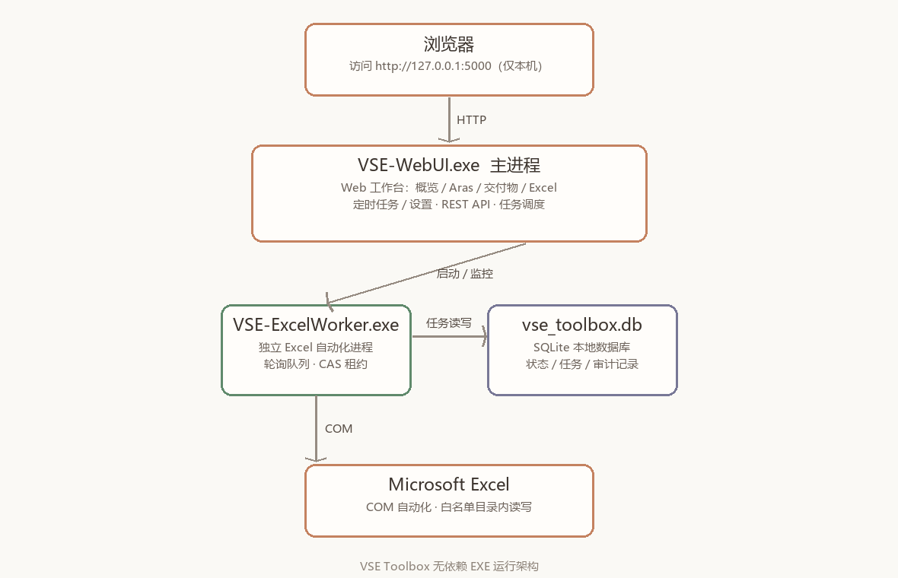
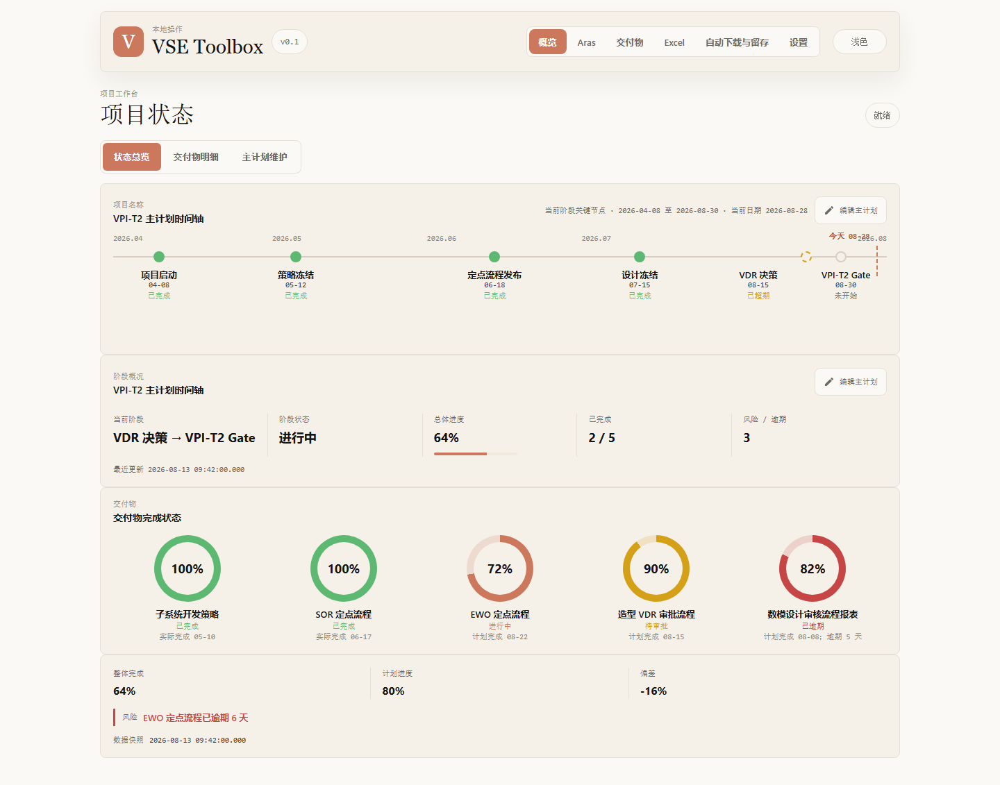
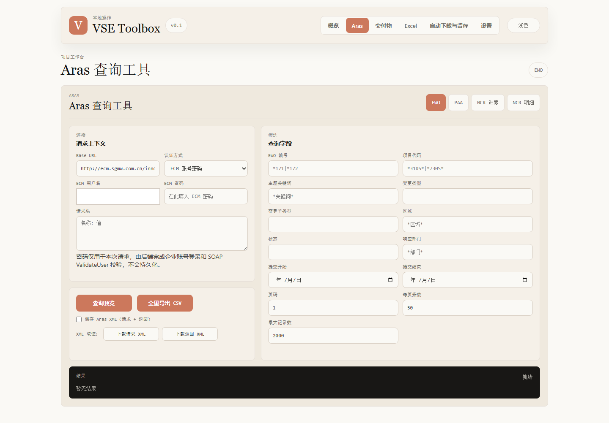
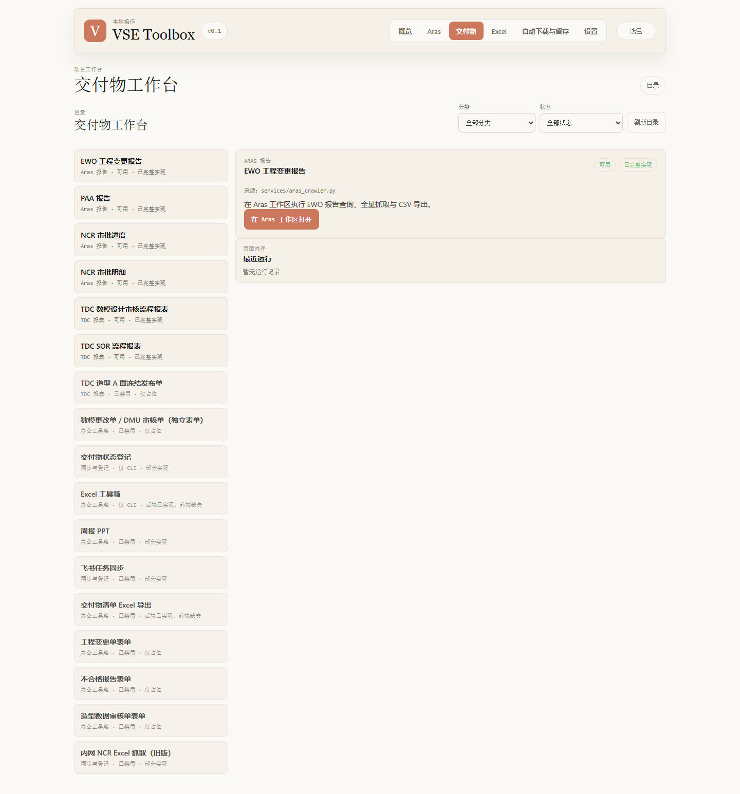
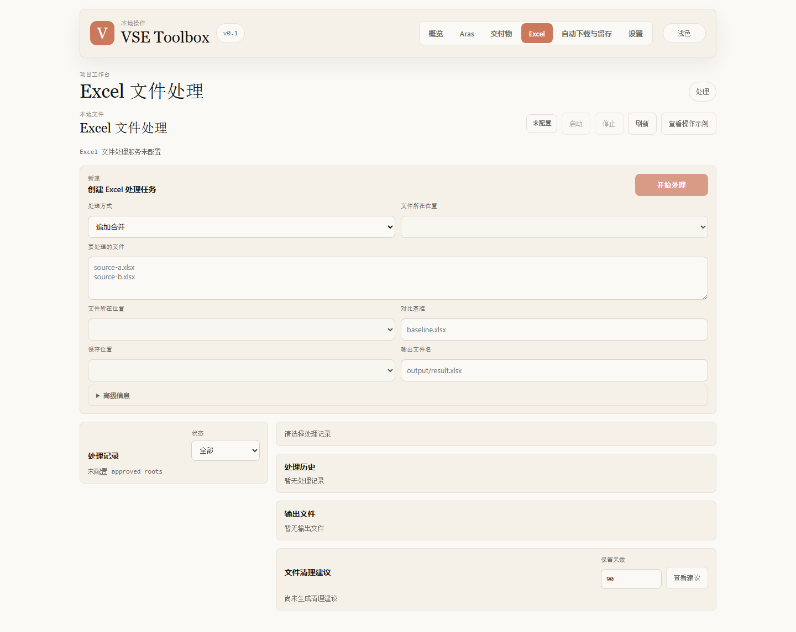
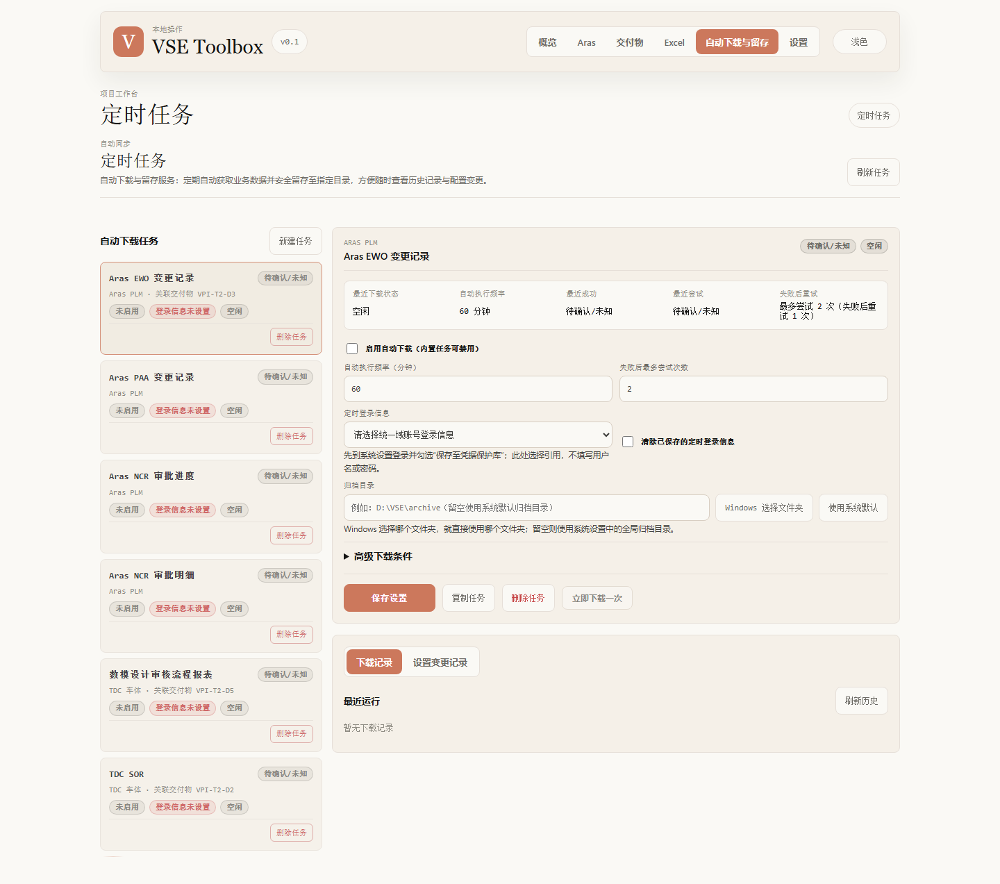
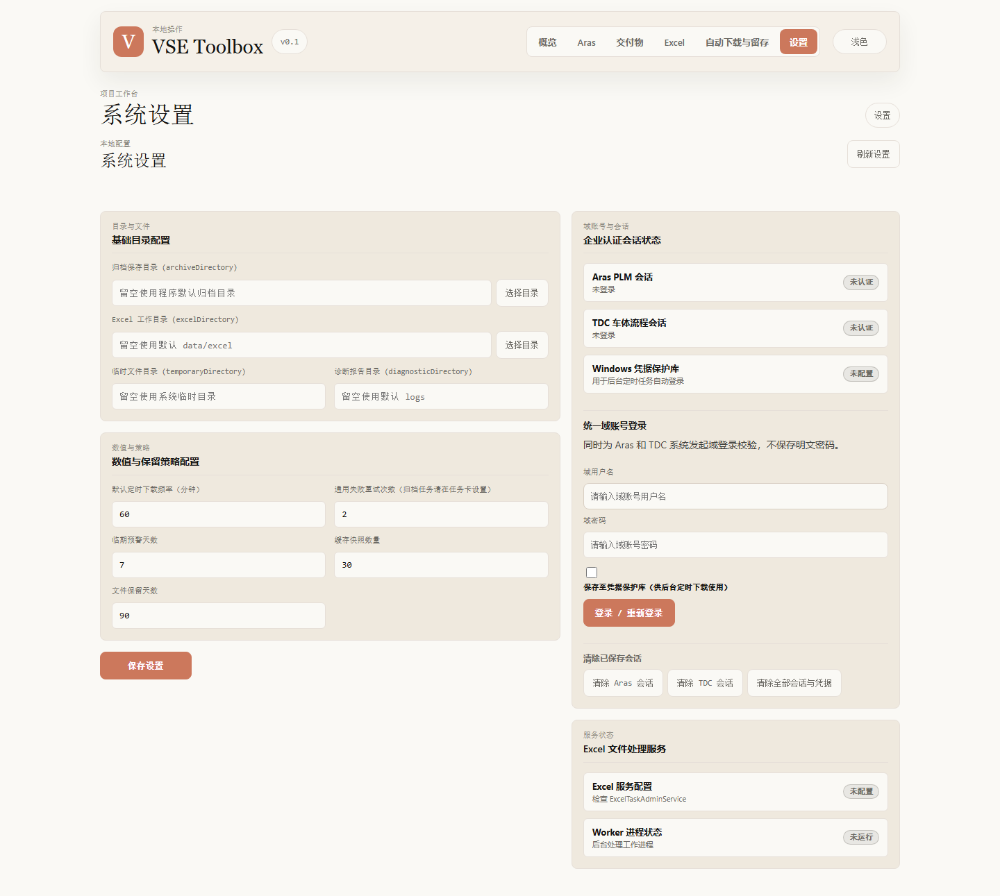
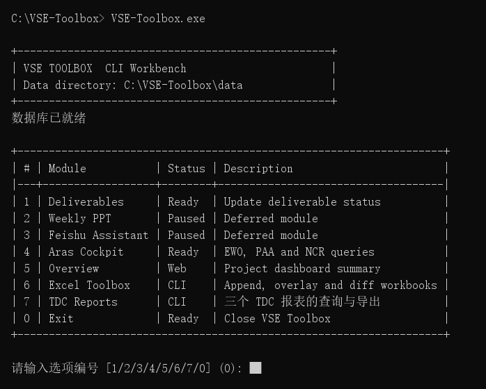

# VSE Toolbox 无依赖 EXE 使用说明

> 状态：Active
> 读者：Operator、User
> 权威来源：当前 WebUI/Worker EXE 构建和生产验收
> 默认读取：按独立 EXE 使用任务读取

> 适用对象：`VSE-WebUI.exe` + `VSE-ExcelWorker.exe`（零依赖独立可执行程序）。
> 无需安装 Python、pip 或任何第三方库，解压即用。本文全部截图取自实际运行的程序界面。

---

## 1. 这是什么

VSE Toolbox 是一套**汽车行业项目管理自动化工具箱**，覆盖项目状态总览、Aras（PLM）报表抓取、
TDC 报表导出、交付物目录、Excel 文件批处理与定时自动下载归档。

“无依赖 EXE”指使用 PyInstaller 打包的独立可执行文件：内部已内嵌 Python 3.12 运行时与全部
依赖库，目标电脑**不需要配置任何开发环境**，普通用户权限即可运行。

## 2. 运行架构

推荐以「Web 工作台」方式使用：双击 `VSE-WebUI.exe` 后，用浏览器操作全部功能；
涉及 Excel 真实读写时，主进程会用 `--excel-worker` 参数**调起自己的第二个进程**
独立完成（同一个 exe，独立进程），两者物理隔离，Excel 崩溃不影响 Web 服务。



## 3. 交付物清单

最新构建位于 `dist/VSE-WebUI-production-20260917/`（2026-09-17 生产测试包，配套 ZIP 传输包为 `dist/VSE-WebUI-production-20260917.zip`）：

| 文件 | 作用 | 是否必需 |
|---|---|---|
| `VSE-WebUI.exe` | Web 工作台主进程（仪表盘、Aras、TDC、定时任务、设置），同时承担 Excel 自动化 | 必需 |
| `SHA256SUMS.txt` | 文件校验值清单 | 建议保留 |

**部署要求**：把整个文件夹复制到任意可写目录（例如 `D:\VSE-Toolbox\`）即可，不需要安装步骤。

> **2026-10-09 起改为单 exe**：Excel Worker 已并入宿主，用 `--excel-worker` 哨兵自调起
> 子进程，不再需要同目录的 `VSE-ExcelWorker.exe`。从旧版文件夹升级时，旧目录里遗留的
> `VSE-ExcelWorker.exe` 不再被调用，可以直接删除；`data/` 文件夹整体保留即可沿用数据库、
> 归档与设置。

> **插件化版本起改为文件夹包（onedir）**：`tools/build_excel_bundle.ps1` 产出
> `dist/VSE-WebUI/` 文件夹和传输包 `dist/VSE-WebUI.zip`。文件夹内有 `VSE-WebUI.exe`、
> `_internal/`（运行时，勿改动）、`plugins/`（功能插件）和
> `SHA256SUMS.txt`（覆盖文件夹内全部文件）。解压后整个文件夹一起使用，不要单独拷出 exe。
> 从单文件版升级时，把旧 exe 旁边的 `data/` 文件夹整体移到新的 `VSE-WebUI/` 文件夹里，
> 本地数据库、归档和设置即可沿用。

**完整性校验**（可选，PowerShell）：

```powershell
cd D:\VSE-Toolbox
Get-FileHash -Algorithm SHA256 .\VSE-WebUI.exe
# 结果与随包的 SHA256SUMS.txt 逐条比对（清单覆盖文件夹内全部文件）
```

## 4. 运行环境要求

| 项目 | 要求 |
|---|---|
| 操作系统 | Windows 10 / 11 / Server 2016+（64 位） |
| 用户权限 | 普通用户即可；需对 exe 所在目录有**写入权限**（数据存放在此处） |
| Office | 仅 Excel 文件处理功能需要已激活的 Microsoft Excel（2016/2019/2021/365） |
| 网络 | 本机 `127.0.0.1` 回环必须可用；使用 Aras / TDC 抓取时需能连通对应企业内网 |

> **数据放在哪？** 程序以“exe 所在目录”为根目录：数据库为 `<exe目录>\data\vse_toolbox.db`，
> 日志与输出文件也在 `data\` 下。若该目录只读，程序会自动改用
> `%LOCALAPPDATA%\VSE-Toolbox\`，控制台日志会打印实际使用的数据目录。

## 5. 首次运行须知

1. **SmartScreen 提示**：exe 未做代码签名，首次双击可能出现“Windows 已保护你的电脑”。
   点击 **更多信息 → 仍要运行** 即可（建议先按第 3 节校验过哈希再放行）。
2. **杀毒软件误报**：PyInstaller 单文件程序偶有误报，校验哈希一致后将目录加入白名单。
3. **不要同时开两份**：默认端口 `5000` 与 SQLite 数据库都不支持多实例抢占。

## 6. Web 工作台模式（推荐用法）

### 6.1 启动与访问

1. 双击 `VSE-WebUI.exe`（会保留一个控制台黑窗口，用于显示运行日志，**关闭窗口 = 停止服务**）。
   服务就绪后会**自动打开默认浏览器**并进入工作台首页；
   如需以无头方式运行（后台计划任务、自动化测试），可在 CMD 中使用：
   ```cmd
   VSE-WebUI.exe --no-browser
   ```
2. 打开浏览器访问 <http://127.0.0.1:5000>。

如端口被占用，可换端口启动（CMD）：

```cmd
set VSE_TOOLBOX_PORT=8080
VSE-WebUI.exe
```

> **界面说明**：文档中部分历史运行截图取自构建基准版本。最新界面已优化全局顶栏指示、原位登录浮层及设置分层。具体功能与交互以当前实际运行界面为准。

首页顶栏包含以下关键控件：
- **版本标识（Version Chip）**：真实展示当前程序版本（如源码运行显示 `开发工作区`，冻结包显示 `独立运行包` 或发布版本号）；点击可展开维护与运行环境详情弹窗，方便技术支持排查。
- **工作区导航**：切换 **概览 / Aras / 交付物 / Excel / 自动下载与留存 / 设置** 六个工作区。
- **企业会话状态栏**：全局实时分别展示 **Aras** 与 **TDC** 的会话连接状态（绿色为有效，黄色为已过期，灰色为未认证），并提供 **登录 / 切换** 按钮，点击可在任意页面打开原位登录弹窗。
- **任务中心（📋 任务）**：右上角任务按钮打开统一任务抽屉，详见 6.10。
- **主题切换**：右上角按钮可在深色、浅色主题间切换。

### 6.10 统一任务中心与后台任务

- **统一任务抽屉**：点击顶栏「📋 任务」打开抽屉，聚合展示 **系统抓取任务、Excel 批处理任务、EWO 增强导表任务** 三类记录，支持「运行中 / 已结束 / 全部」筛选、取消、重试与工件下载。
- **后台任务化**：「全量抓取」与大导出（Aras EWO/PAA 导出、TDC 数模/SOR 导出）提交后立即返回，进度实时显示在任务中心；抓取完成后面板自动展示结果，导出文件请在任务中心下载。
- **工件保留期**：导出与结果文件统一落盘至 `data\downloads\`，系统自动清理 **7 天**前的过期文件，无需手工清理。
- **取消语义**：全量抓取支持在分页边界协作式取消（约 2 秒内响应）；任务失败会保留脱敏后的错误信息。
- **EWO 冻结重试红线**：EWO 增强导表任务出现「生成结果未知（generation_unknown）」时，任务中心**不提供自动重发**，仅允许在 EWO 增强导表面板人工核查状态后处理，避免向源系统重复发起生成请求。
- **凭据红线**：后台任务不支持账号密码或显式 Cookie 模式（凭据禁止入库持久化）；请先在「设置 → 统一域账号登录」完成登录，再提交后台抓取/导出任务。

### 6.11 数据表格交互增强

查询与抓取结果表格已升级为交互网格：

- **点击表头排序**：单击切换升序 → 降序 → 取消；按住 `Shift` 点击可叠加多列排序（表头显示 ▲/▼ 与次序标号）。
- **关键字快筛**：表格顶部输入框实时过滤并高亮命中关键字，无需点击查询按钮。
- **紧凑分页**：每页 50 / 100 条可切换，显示「共 N 条 · 第 x/y 页」。
- **列显隐偏好**：「列显隐」面板支持 **常用列 / 全量列** 一键切换与逐列多选，自定义结果保存在本机浏览器（localStorage），下次查询自动恢复；敏感列（Cookie、Token 等）始终被排除。
- **一键复制单号**：鼠标悬浮单号类单元格（EWO号、SOR号、编号等）时出现 📋 图标，点击即复制（不支持剪贴板 API 的环境自动降级为兼容复制方式）。

### 6.12 交付物明细页：数据同步摘要卡与自动同步向导

- **数据同步摘要卡**：交付物明细页顶部固定展示「数据同步」摘要卡，显示当前同步状态标签、
  最近尝试 / 最近成功时间与脱敏后的最近错误；未启用同步时提示当前为手工维护或待配置。
- **开启自动同步向导**（可同步交付物）：点「开启自动同步」展开轻量向导，只需两步输入——
  1. **同步凭据引用**：已在系统设置登录并勾选“保存至凭据保护库”时自动选中统一域账号
     （只保存凭据别名引用，不保存用户名或密码）；
  2. **外部编号**：按提示填写一个外部单号（如 EWO 号）。
  点「开始配置并启用」后系统自动完成：抓取映射证据（需连续两次一致的脱敏取证，2/2）→
  从最新脱敏字段报告推导字段映射 → 保存同步绑定 → 自动触发一次首同步并显示结果。
  候选记录不唯一时会让您选择一次目标记录；**推导不出字段映射时向导会明确提示原因并引导
  打开「高级设置」手工完成映射后保存**，系统绝不猜测映射。
- **立即同步**：已启用自动同步的交付物，摘要卡提供「立即同步」按钮，点击即从来源系统
  拉取一次最新数据，完成后显示成功 / 部分字段已应用 / 需要处理 / 失败及脱敏原因。
- **映射取证的时限、后台执行与取消**：向导的「映射取证」是全量抓取。统一域账号会话下，
  服务端把它作为后台任务运行（页面只等受理握手，随后轮询结果，进度可在顶栏「任务」中
  查看或取消）；密码 / Cookie 模式出于凭据不落库的约束仍同步执行，TDC 列表最长等待
  90 秒、Aras 工作簿导出最长 240 秒，超时即同时通知服务端停止抓取，并提示「可稍后重试」
  （上游暂时不可用时给出网关提示而不是“配置启用失败”）。同一向导会话内第 2 次核验对
  TDC 只拉取第 1 页并与首次基线比对（报告记录数变化、样本不在基线、字段结构变化等具体
  原因）；NCR 的两次导出始终相互独立。取证期间点击「开始配置并启用」不会重复发起。
- **高级设置**：完整绑定表单（匹配规则、字段映射、更新方式切换等）整体收起在「高级设置」
  折叠区内，日常操作无需展开。
- **SOR 定点流程明细口径（2026-09-26 修复）**：同步行内的嵌套对象（车型项目、审批状态）
  已在写入前扁平化为纯文本（如 `F610S`、`已完成`），明细、状态筛选与「当前状态」卡口径
  一致；修复前的历史快照不追溯，**重新同步一次**即可。注：页面同步接口为工作流粒度，
  零件号 / 零件名称 / 部门 / 科室四列以官方 Excel 导出（零件粒度）为准——两者的行数与
  字段覆盖不同（见 6.15 的快照统计说明）。
- **数模设计审核流程明细「状态」列**：明细表在「部门」后提供「状态」派生列
  （读行状态维度渲染），无需横向滚动到 47 列末位；明细筛选条的「状态」多选与同步向导
  的「状态（选填）」输入此前已支持。
- **官方工作簿来源（NCR 两项）**：其「数据同步」摘要卡会额外说明准入语义——只有表头契约、
  逐行归类核对与未截断三条同时满足才写入快照；该类来源没有声明总数，因此“成功”不构成
  来源侧零丢失的证明（详见 6.14）。

### 6.13 自动同步常驻调度

- **默认开启**：`VSE-WebUI.exe` 启动时自动拉起项目状态同步调度线程，按间隔为已启用的
  自动同步交付物做补偿性后台同步；距上次成功同步不足一个间隔的绑定直接跳过，
  不产生网络请求。
- **调整间隔**：设置环境变量 `VSE_PROJECT_STATUS_SYNC_INTERVAL`（单位：秒，正整数），
  默认 `900`（15 分钟）；非法值自动回落默认。CMD 示例：

  ```cmd
  set VSE_PROJECT_STATUS_SYNC_INTERVAL=1800
  VSE-WebUI.exe
  ```

- **关闭调度**：如需完全关闭常驻调度（例如只想手工点「立即同步」），CMD 中使用：

  ```cmd
  VSE-WebUI.exe --no-sync-scheduler
  ```

  关闭后不影响手工同步，也不影响“自动下载与留存”页的定时归档任务。

### 6.14 外部来源交付物（PAA 报告 / NCR 审批进度 / NCR 审批明细）

- **PAA 报告、NCR 审批进度、NCR 审批明细**三项交付物与 EWO 使用**同一套同步结构**：
  在各自明细页用同一个轻量向导配置（统一域账号凭据、车型项目、责任部门、定时周期），
  启用后同样常驻提供【立即同步】与【修改同步配置】，并参与常驻调度（见 6.12 / 6.13）。
  也可以只保留定时归档任务，由归档产生的表单快照更新展示。
- 这三项由最新有效表单快照驱动展示（仅作参考），明细页中**只读**，不可手工编辑；
  尚无快照时显示“待同步”，不展示编造进度。
- 这三项**不计入总体进度统计分母**（仅参考展示）。
- **NCR 两项的来源是官方工作簿导出**：同步时只有同时满足「表头与已批准契约一致」「逐行归类
  核对无剩余」「工作簿未被截断」才会写入快照；任一条不满足即整体失败并在明细页给出脱敏原因，
  不会把可能的少行当成完整数据。工作簿本身**没有声明总记录数**，因此这类来源的“成功”表示
  *满足准入条件*，不构成“来源侧零丢失”的证明；每次归档的簿记事实（读取/解析/空行/未归类行数、
  停机原因）会随归档清单（manifest）一并留存，便于事后核对。
- **NCR 报表没有部门维度，向导用「科室（选填，可多选）」按预设归集**：科室维度与看板
  「科室归集规则」同源——预设目标为车身科、车体科、内饰科、外饰科、车体架构集成科
  （可在归集规则中编辑），其他科室值计入「未归集」；向导中的科室选择随配置保存
  （便于核对同步范围），不改变导出查询（科室名→导出代码的映射契约未确立）。
  此前把部门名当科室代码发给导出方法会导致官方导出生成不了文件（2026-09-26 生产
  实锤，已修复）；若导出仍未返回文件引用，报错会附带**响应结构签名**并生成诊断
  文件，按提示回传该文件即可进一步定位。归档任务/高级设置如配置官方科室代码
  （`BA/BE/BI/EXT/INT/SES/VE`，白名单解析），仍会按代码做上游与本地收窄。
- **PAA / NCR 的「当前状态」卡与统一表单分析同口径**：状态为 `CLOSE` 的行在两处都计为
  已完成（2026-09-26 修复：此前分析口径不识别 PAA/NCR 的 CLOSE 字面值，顶部卡显示 0%）。
  该修复对修复前已生成的分析快照不追溯，**重新同步一次**即可刷新。

### 6.15 表单快照统计分析（“统计分析”折叠区）

支持表单快照的交付物在明细页提供「统计分析」折叠区，展开时按需读取最新快照的
确定性统计结果（纯统计学计算，无 AI）：

- **停滞天数**：在途记录的停滞天数 = 当前日期 − 最后活动日期（优先当前节点到达日，
  回退提交 / 申请日期）；时间列缺失或非法的记录剔除出停滞统计并单独计数。
- **指标卡**：在途记录停滞天数的平均停滞、中位数、标准差与最长停滞；无在途停滞记录
  （或时间列不可用）时显示“-”，仅展示状态分布。
- **状态分布**：按状态统计记录数与占比。
- **停滞 Top5**：停滞最长的 5 条在途记录（单号、当前步骤、状态、停滞天数）。
- **离散度排名（跨快照方差）**：基于最近历史快照，对同一单号至少两次观测的记录按停滞
  天数方差降序排名；历史快照不足时提示暂无排名。
- 该交付物尚无快照时显示“暂无快照数据”。

### 6.16 部门总状态双分页看板与科室归集

EWO / PAA / NCR 审批进度的明细页「部门状态」看板拆为两个分页，NCR 审批明细提供
单页「按科室」统计：

- **按科室**：每行一个归集后科室，柱内色段为各审批节点 / 业务状态的数量占比；
  **按状态**：每行一个审批节点 / 业务状态（完整枚举按流程顺序展示，含当前无数据项），
  柱内色段为各科室的数量占比。色块内为数量，悬停可查看「行 · 段：n 条（占比）」。
- 「状态」的口径：EWO 为 `DRAFT1/DRAFT2/EDIT1/EDIT2/PROC/IMPL/CLOSE`，PAA 为
  `DRAFT1/DRAFT2/EDIT/PROC/IMPL/CLOSE`，NCR 审批进度为审批节点（`PE提交`→…→`CLOSE`），
  NCR 审批明细无状态维度。原「按期推进 / 逾期风险 / 未判定」配色不再是该看板的分色维度，
  仍可在明细筛选与预警中使用；点击行追加筛选、图表随筛选联动等交互与之前一致。
- **科室归集规则**（看板下方折叠面板）：因历史原因下发人员科室五花八门（如车身科的
  前身「结构工程科」「车门附件科」），图表与「科室 / 区域」筛选都先按规则归集到现行
  科室再统计；未登记的历史值计入「未归集」，不会静默丢弃。点【编辑规则】可自行增删
  每个目标科室的历史值、新增目标科室，保存后**立即生效**——只调整统计口径，
  不改写原始数据，无需重新同步。规则保存在本地数据库；同一历史值只能归属一个
  目标科室，空值与重复值在保存时拦截。
- **匹配口径（2026-09-26 升级）**：匹配忽略空格差异（含全角空格、双空格、零宽字符），
  并自动识别「英文缩写前缀 + 空格」形态——登记「结构工程科」即可命中 `BE 结构工程科`，
  登记目标科室名即可命中 `BI 车体科` 这类带前缀的值。**不做包含匹配**：`非车体科`、
  `车体科/内饰科` 这类值不会被误归集，进「未归集」；无空格分隔的写法（如
  `BE结构工程科`）不自动剥离，需把完整写法登记为历史值。保存时按「忽略空格后」
  形态查重，跨目标冲突会逐字段报错；本地数据库里手工改动出的冲突键在读取时按
  未归集处理，不会让看板不可用。
- 明细表仍显示原始科室值（数据保真）；筛选条件、图表与导出口径按归集后的科室呈现。
  携带历史科室值的旧筛选链接 / 书签不会自动命中，需先在归集规则中把该值登记为对应
  科室的别名。
- 数模 / SOR 两张报表的看板语义不同（项目 / 车型、部门），保持原有形态，不参与科室归集。

### 6.17 签署日报：3D单签署进展三图一表

左侧导航「签署日报」。从选范围到拿到可发的邮件：

1. 选项目/车型和归属科室（按申请人在花名册里的科室），需要时打开「只统计关注清单」；确认区域名和固定文案。上次的选择和该范围的文案会自动带出。
2. 点「一键生成」：后台抓取 TDC 并显示进度，抓完自动生成；已有抓取在跑时沿用它。抓取失败时可点「用最近一次数据生成」，页面会标明用的是旧数据，不写快照、不显示日变化。
3. 预览顶部依次提示：长周期初筛待确认（会拦住导出）、待补录人员、同名或历史科室、关注清单里找不到的单号、数据异常条数。
4. 长周期复核：确定命中默认勾选、疑似默认不勾选，排除项可在折叠区强制纳入，没命中的零件可搜索后手工纳入。点「确认并记住」写入记忆（之后同一项目不再提示）；或点「本次按建议继续」只对这一次放行。
5. 欠账只算「当前待办」，也就是 TDC 的「待审批人员」里的每个人：他在角色列里未签就按所在列归属；不在任何角色列的是加签人，按花名册科室（未在册则按他最常出现的会签列）归属；已签的设计工程师被点名是「退回修改」。带「(未签)」但不在待审批人员里的人不计欠账，只在明细表写「另 n 人未签、非当前待办」。当前阶段分会签中、审批中、退回修改、待提交、待锁定。
6. 正文顺序固定：汇总数字、图1 外区域会签欠账、图2 内部科室会签欠账、图3 审批欠账、在途流程明细表。点「复制正文」直接粘到飞书邮件；每张图也可以单独复制或下载。经典版 Outlook 用户可以下载 .eml 草稿。
7. 收件人 = 本范围的固定名单 + 当天有欠账且在通讯录里的人；通讯录里没有邮箱或同名多个邮箱的人，会在导出前列出来。

「设置」里维护花名册、长周期规则与词表、长周期结论（按项目清空或单条改判）、未在册人员指定区域、外部列区域显示名、通讯录和阈值。花名册和长周期规则支持 CSV/xlsx 导入：先预览新增、变更、删除、冲突和错误行，确认后才写入；每次导入前自动备份（保留 5 份），可随时恢复或恢复内置种子。

### 6.18 数模设计审核流程报表：关注清单、多值搜索与同步设置列

- 交付物详情页的搜索框可以一次粘贴多个流水单号、零件名称、零件号或申请人（空格、逗号、分号、顿号、换行都行，Excel 一列直接粘）。结果上方显示「匹配 n 份表单；k 个词没有匹配」，并列出没匹配上的词。
- 「全部加入关注清单」把搜索结果加入清单；清单可以逐条移除、清空、导出 CSV。同步范围选「仅同步关注清单」后，自动同步和自动归档都只落清单里的表单，进度只按清单计算，并标注「关注 n 份」。清单里在 TDC 查不到的单号会标「未找到」并留在清单里；清单为空时不会同步，显示「待配置：关注清单为空」。
- 交付物明细列表新增「同步设置」列：直接显示和修改启用、同步间隔、筛选条件和更新方式，也可以多选批量启用、停用或改间隔，不用进明细页。没写自己间隔的交付物跟随同步条上的调度频率。「立即全量同步」会先列出本次会同步哪些交付物和各自的筛选条件，可以取消勾选。调度器在运行但一个都没启用时，同步条会用警示色提示。

### 6.2 概览：项目状态一屏掌握



- **主计划时间轴**：按当前阶段展示项目关键节点与完成状态（如“VPI-T2 主计划时间轴”），“今天”
  红线右侧即未来节点；点击 **编辑主计划** 可修改节点日期。
- **阶段概况**：当前阶段、总体进度、已完成 / 待同步 / 总计、风险/逾期数量一目了然。
- **交付物完成状态**：环形图逐项显示每条流程的完成度与状态。已接入来源同步的交付物显示
  快照进度；尚未配置同步、同步中、同步失败、无来源记录或已暂停的显示对应状态标签
  （不展示占位进度）。**点击环形图可直接进入该交付物的明细与分析页**。
  按产品口径，两项仅手工维护的交付物（子系统开发策略、造型 VDR 审批流程）不在环形图与
  「交付物明细」表格中展示；其数据、明细页与分析接口仍可通过接口与深链访问，也仍参与统计口径。
- **交付物明细页**提供「更新方式」配置：可同步的交付物（SOR 定点流程 / EWO 流程 /
  数模设计审核流程报表）支持 **手工维护 / 自动同步 / 混合模式**——绑定统一域账号、
  填写匹配规则并连续两次抓取一致的映射证据后即可启用；启用后点 **立即同步** 即可从
  来源系统自动更新负责人、计划完成日期与风险备注，环形图与明细表随之显示快照结果。
  摘要卡、一键开启向导与常驻同步调度的日常用法见 6.12 / 6.13；外部快照交付物与
  “统计分析”折叠区见 6.14 / 6.15。
- 顶部子页签 **交付物明细**、**主计划维护** 可切换到交付物表格视图（可进入单条交付物的明细与
  编辑页）与计划编辑视图。

### 6.3 Aras：EWO / PAA / NCR 报表查询与导出



1. 右上角选择报表类型：**EWO / PAA / NCR 进度 / NCR 明细**。
2. 报表查询复用企业统一域账号认证（通过顶栏“登录 / 切换”或在“设置”中完成登录），系统使用内存安全会话向企业系统发起请求，不保存明文密码，不再需要手动配置浏览器 Cookie 或复杂的 HTTP 请求头。
3. 在 **查询字段** 中按编号、项目代码、关键词、日期范围等条件过滤。
4. 点击 **查询预览** 先看少量数据，确认无误后点 **全量导出 CSV**（Excel 可直接打开）。
5. 勾选 **保存 Aras XML** 可额外留存请求/返回报文，用于审计取证（下载请求 XML / 下载返回 XML）。

> **原位登录与操作恢复**：若查询时企业会话已过期，页面错误区将明确提示“企业域账号会话已过期”，并提供 **重新登录** 按钮；点击后将在当前页面弹出登录浮层。登录成功后，原页面填写的查询条件、表单草稿与已有结果**完整保留**，点击 **继续查询** 即可恢复获取数据，无需跳转或重新填写表单。

### 6.4 交付物：报表功能目录



左侧是全部交付物/报表目录（含可用、仅占位、部分实现等状态标签），右侧显示所选条目的说明与
**“在 Aras 工作区打开”** 等入口按钮。顶部可按分类、状态筛选并刷新目录。
灰色的“仅占位/已禁用”条目属于规划中功能，暂不可用。

打开具体条目后可进入操作表单：直接使用统一企业会话与查询条件，
支持 **查询预览 / 全量抓取 / 导出下载**。TDC 数模设计审核与 SOR 报表额外提供两种查询模式：
**快速查询（list 接口）** 与 **官方 Excel 精确预览（较慢，与内网报表列完全一致）**，
查询后可直接 **下载 XLSX**。如遇到会话失效，同样可在原位直接完成登录并继续操作。

### 6.5 Excel：文件批处理（合并 / 叠加 / 比对）



1. 首次使用先完成 **Excel 文件处理服务配置**（未配置时页面顶部会提示，可在本页或“设置”页完成）。
2. **创建 Excel 处理任务**：选择处理方式（如追加合并）、文件所在位置（白名单目录下拉选择）、
   填写要处理的文件清单；比对类任务再指定对比基准。
3. 点击 **开始处理**，任务进入队列，由后台 Worker 进程逐个执行。
4. 下方 **处理记录 / 处理历史 / 输出文件** 可查看执行进度并下载生成的 `.xlsx`；
   **文件清理建议** 会按保留天数提示可清理的历史文件。

涉及真实 Excel 读写时需要启动 Worker，见 6.7。

### 6.6 自动下载与留存：定时任务



- 左侧是自动下载任务列表（Aras EWO / PAA / NCR 进度 / NCR 明细、数模设计审核流程报表、TDC SOR 等），
  点 **新建任务** 可添加自定义任务；每个任务卡片与详情页均提供 **删除任务**（归档式移出列表，
  带并发保护，配置被他人改动时会提示刷新重试），也可用 **复制任务** 基于现有任务快速建新。
- 右侧配置单个任务：勾选 **启用自动下载**（内置任务可禁用）、设置 **自动执行频率（分钟）** 与
  **失败后最多尝试次数**；**定时登录信息** 引用“设置”页保存的域账号（存入 Windows 凭据保护库，
  不保存明文）；**归档目录** 支持三种方式：直接输入路径、点 **Windows 选择文件夹** 弹窗选择、
  或点 **使用系统默认**。
- **保存设置** 生效后可点 **立即下载一次** 做手工触发验证；**下载记录 / 设置变更记录** 页签保留完整
  历史供追溯。

> “Windows 选择文件夹”弹窗依赖桌面会话，请勿在服务/无人值守会话中使用该按钮，直接填路径即可。

### 6.7 设置：日常与高级维护分层



系统设置采用业务分层设计，日常高频配置一目了然，底层实现字段与低频参数安全折叠：

- **日常业务目录设置（默认展开）**：
  - **归档保存目录**：定时自动下载与历史归档数据的存放位置（留空使用默认 `data/archive`）。
  - **Excel 工作目录**：Excel 文件批处理任务的默认文件读写根目录（留空使用默认 `data/excel`）。
- **高级与维护设置（默认折叠）**：
  点击卡片标题展开后可配置系统运行参数（底层字段名已转为友好中文，折叠不影响配置的正常保存）：
  - **临时文件缓存目录**：数据处理中间文件的存放路径（留空使用系统临时目录）。
  - **系统诊断日志目录**：排查问题时的日志与诊断文件输出路径（留空使用默认 `logs`）。
  - **网络请求失败重试次数**：仅控制单次查询与在线抓取失败时的自动重试；定时下载任务的重试在对应任务卡中独立配置。
  - **默认定时下载周期**、**交付物临期预警阈值**、**历史快照保留数量**、**历史文件保留天数**。
- **企业认证会话与统一域登录**：
  - 分别查看 **Aras ECM** 与 **TDC 研发流程** 的认证状态与更新时间。
  - 通过统一域账号登录同时建立两端会话；密码仅在内存中用于校验，不落盘。
  - 勾选 **保存至凭据保护库** 时，凭据将写入本地 Windows 凭据管理器（DPAPI 加密保护），严格限定供后台定时自动下载使用；若未勾选，仅作为当前临时会话使用，权限不默认扩大。
- **Excel 文件处理服务**：显示服务配置与 Worker 进程状态；也可回到 Excel 页点 **启动 / 停止**
  控制 Worker（状态卡片在 `未运行` ↔ `运行中` 间切换）。

### 6.8 Worker 的启动与停止

- **界面方式（推荐）**：Excel 页点 **启动**，主进程自动调起同目录的 `VSE-ExcelWorker.exe`；
  点 **停止** 优雅停机（处理完当前文件后退出，不残留 `EXCEL.EXE` 进程）。
- **命令行方式**（适合批处理 / 计划任务）：

```cmd
:: 单次模式：处理完一个任务即退出
VSE-ExcelWorker.exe run-once --db data\vse_toolbox.db --root business=D:\ApprovedExcel

:: 常驻轮询模式：每 5 秒检查一次任务队列
VSE-ExcelWorker.exe run --db data\vse_toolbox.db --root business=D:\ApprovedExcel --poll-interval-seconds 5
```

- `--root 编号=目录` 定义**白名单根目录**，任务只允许读写白名单内的文件（防路径穿越）。
- `--no-json` 可切换为人类可读日志输出；常驻模式下按 `Ctrl+C` 优雅退出。
- 若 Worker 被强杀（如 `taskkill /F`），其持有的任务租约到期后会被标记为 `stale`，
  重新启动 Worker 后按重试策略自动恢复执行。

## 7. 终端 CLI 模式（可选）

同目录如放置了 `VSE-Toolbox.exe`，可在 CMD 中运行纯终端交互菜单（无需浏览器）：



| 编号 | 模块 | 说明 |
|---|---|---|
| 1 | Deliverables | 更新交付物状态 |
| 4 | Aras Cockpit | EWO / PAA / NCR 查询与 CSV 导出 |
| 5 | Overview | 输出项目概览摘要（完整界面请用 Web 模式） |
| 6 | Excel Toolbox | 多工作簿追加、叠加与差异比对 |
| 7 | TDC Reports | 数模设计审核 / SOR / 造型 A 面冻结发布单报表 |
| 0 | Exit | 退出 |

输入编号回车即可进入对应功能；菜单、密码输入等均遵循终端内提示。

## 8. 停止与卸载

- **停止 Web 服务**：关闭 `VSE-WebUI.exe` 的控制台窗口，或在窗口内按 `Ctrl+C`。
- **停止 Worker**：Excel 页点 **停止**，或 `Ctrl+C` / 删除 stop 文件。
- **卸载**：直接删除部署目录即可；如需彻底清理本地数据，一并删除
  `%LOCALAPPDATA%\VSE-Toolbox\`（若存在）。

## 9. 常见问题（FAQ）

**Q1：双击后一闪而过 / 浏览器打不开 5000 端口？**
端口被占用或被安全软件拦截。用 `set VSE_TOOLBOX_PORT=8080` 换端口重启；确认控制台窗口未关闭。

**Q2：提示 “Approved root directory not found”？**
Excel 任务的文件必须在 `--root 编号=目录`（或界面中配置的工作目录）白名单内，且目录真实存在。

**Q3：Worker 执行任务时报 COM 错误 / 卡住？**
先手动打开一次 Excel，完成激活并关闭所有首次运行弹窗；再用任务管理器清理残留的
`EXCEL.EXE`（`taskkill /F /IM EXCEL.EXE`）后重试。

**Q4：Worker 被误杀后任务一直排队？**
任务租约超时后会自动标记 `stale` 并按重试策略恢复；重启 Worker 即可继续。

**Q5：密码会保存在哪里？**
查询类请求的密码仅当次使用、不落盘；定时任务的域账号凭据保存在 Windows DPAPI 凭据保护库，
只能由当前 Windows 用户解密。日志与接口返回中的敏感字段统一脱敏为 `[REDACTED]`。

**Q6：怎么确认下载的产物没损坏？**
任务审计记录中保存了产出文件的 SHA-256，可与本地文件 `Get-FileHash` 结果比对。

**Q7：想开机自启？**
创建 `VSE-WebUI.exe` 的快捷方式放入 `shell:startup`，或在任务计划程序中配置“登录时启动”。

---

### 查询状态与任务反馈指引（易用性第二阶段）

1. **查询结果状态与有效空结果**：
   - 当在 Aras 查询（EWO/PAA/NCR）或 TDC 交付物查询中检索到 0 条数据时，界面将显示明确的“未查询到符合条件的记录”卡片，并完好保留您的筛选草稿，方便随时微调条件重新查询；
   - 若某次查询之前已成功展示数据，但在后续重新查询时遇到网络抖动或异常，系统将保留原有的历史结果，并在结果区顶部标明“未能获取最新数据，已为您保留上次查询成功的历史结果”，避免页面数据骤然丢失。
2. **任务与归档操作反馈**：
   - Excel 任务面板在处理记录为空时，提供友好的操作引导说明；若列表网络拉取失败，可通过顶部【刷新】按钮重新读取；
   - 定时归档在网络读取下载记录失败时，会明确提示“后台已产生的归档文件不受影响”，区分界面展示失败与后台归档执行状态。

> **发布与版本注意**：本说明对应的各项易用性优化（真实版本显示、顶栏会话徽章、原位登录现场保护、结构化错误卡片、设置分层及查询状态反馈）已包含在最新的 `dist/VSE-WebUI-production-20260917` 单文件运行包中。真实企业内网环境交互与 Office COM 批处理仍需在测试机上实测验收。

---

更多背景与验收细节参见：
[生产环境操作与测试指南](PRODUCTION_OPERATION_GUIDE.md) ·
[第二阶段 WebUI 人工验收清单](WEBUI_PHASE2_MANUAL_CHECKLIST_20260916.md) ·
[Excel 任务 Worker 说明](EXCEL_TASK_WORKER.md) ·
[Excel 生产验收记录](EXCEL_PRODUCTION_ACCEPTANCE.md)
