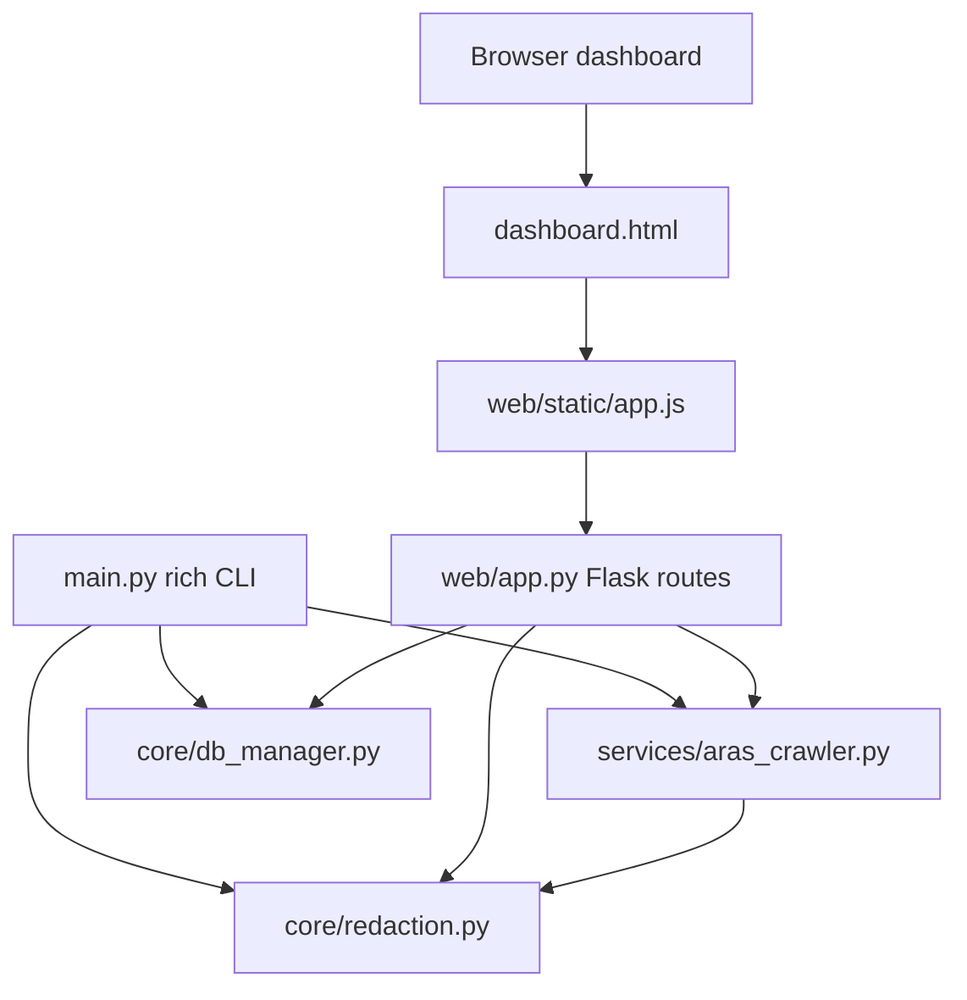

# VSE Toolbox Interface Refactor Implementation Plan

日期: 2026-06-27  
角色: Architect  
适用范围: 后续 Worker 的 Web 前端与 CLI rich 交互重构  
本轮 Architect 修改范围: 仅 `docs/agents/implementation_plan.md` 与 `docs/agents/task.md`

## 目标

把当前的 VSE Toolbox 从“功能可跑的 CLI/Web 适配层”重构为一套一致、克制、可维护的双界面体验:

- Web 对标 Claude 桌面端官方美学（Warm Cream + Coral Primary + Serif Display Heading）: cream canvas、coral primary、dark product surface、serif display heading、humanist sans body、低阴影与 hairline border，但首屏必须是可用业务界面，不做营销页。
- CLI 对标 Claude Code CLI 的终端体验: rich 作为唯一渲染基座，使用莫兰迪低饱和色系、动态 Spinner、优雅 Panel、层级清晰的交互流。
- CLI 与 Web 仍然只是 Interface Adapter。`services/*` 与 `core/*` 不得反向依赖 `rich`、`flask`、DOM 或任何界面库。
- 后续 Worker 必须只做 scoped edits。当前工作树已有用户或历史改动，尤其 `main.py` 已脏，严禁 `git reset`、`git checkout --`、回滚无关文件或清理无关 diff。

## 当前系统观察

现有结构:

- CLI 主入口在 `main.py`，包含 banner/menu、Excel 子菜单、Aras 二级菜单、EWO/PAA/NCR 结果渲染、错误脱敏。
- Flask API 在 `web/app.py`，包含 `GET /api/overview` 与 Aras EWO/NCR 三条 POST API。
- 前端是单页 dashboard: `web/templates/dashboard.html`、`web/static/style.css`、`web/static/app.js`。
- Aras 核心能力在 `services/aras_crawler.py`，已经有 `EWOReportFilters`、`PAAReportFilters`、`NCRApprovalFilters`、`query_paa_report()`、`crawl_paa_report_all()` 等 DTO 与 service 方法。

确认到的结构性风险:

- `main.py` 中 `PROJECT_ROOT` 初始化有两处语义: 先用 `Path(__file__).resolve().parent` 做 `sys.path` bootstrap，后又用 `app_root()` 覆盖。
- `main.py` 中 `handle_intranet_scrape` 有两处定义。前一处是旧的 P1 暂缓 stub，后一处是当前真正的 Aras CLI handler。Python 运行时以后者覆盖前者，但源码阅读和后续修改都容易误伤。
- `main.py::_render_paa_result` 通过 `Exception(str(value))` 包一层再调用 `_safe_error_message`，语义别扭，应该改为直接的 display-value 脱敏函数。
- `web/app.py::create_app()` 里 `DatabaseManager()` 连续实例化两次。
- Web API 尚未暴露 PAA 查询和 PAA 全量抓取，但 CLI 已支持 PAA 两种模式，导致双轨界面能力不对称。
- `app.js::renderRows` 依赖对象 key 出现顺序且只截取前 12 列。不同响应、不同 Python dict 构造路径会让列顺序漂移，不适合业务表格。
- Web 与 CLI 各自维护脱敏正则，长期会漂移。

## 边界原则

1. 当前 Architect 不改生产代码，只写文档。
2. Worker 可以改生产代码，但只允许改任务单列出的文件；任何额外文件必须先说明必要性。
3. Worker 开始前必须记录 `git status --short`，不得回滚未由自己创建的改动。
4. 所有真实 HTTP、内网访问、Cookie、Authorization、token、session、csrf 都不得写入源码、fixture、文档或日志。
5. Web 零构建、零 CDN。Display heading、Body/UI、Code/table 字体均通过本机字体优先栈启用，不从 Google Fonts 或外网拉取。
6. 界面样式可以高级，但业务功能必须优先: overview 能加载，Aras EWO/PAA/NCR 能发起请求、显示结果、显示错误。

## 推导过程

### 1. Web 架构方案对比

| 方案 | 描述 | 优点 | 缺点 | 裁定 |
|---|---|---|---|---|
| A. 只换 CSS | 保留现有 HTML/JS 结构，只把颜色改深、卡片改漂亮 | 风险最低，改动少 | 不能解决 PAA 缺失、列顺序漂移、状态管理混乱；视觉只是涂层 | 推翻 |
| B. 引入 React/Vue/Vite | 用现代 SPA 重写 dashboard | 组件化最好，状态管理清晰 | 当前项目是内网工具；引入 Node/build/CDN/包管理会显著增加部署和审计成本 | 推翻 |
| C. Flask 模板 + 原生模块化 JS + 设计 token | 保持零构建，以 HTML/CSS/JS 重构为 app shell 与 state modules | 部署成本低，能解决状态、布局、API parity；符合当前代码形态 | 组件复用要靠自律，JS 文件需要清晰分区 | 采纳 |
| D. 纯服务端渲染 | 所有结果由 Flask render HTML fragment | 安全边界简单 | Aras 查询是异步长请求，用户体验差；表格交互、loading、queued 状态弱 | 推翻 |
| E. 做成静态报告页 | 把 overview 和 Aras 结果预生成 | 可离线展示 | 不能满足实时查询和 Cookie/header 注入 | 推翻 |

最终选择 C。原因是本项目的主要约束不是“构建复杂 UI”，而是“在受限内网环境里稳定交付可用工作台”。零构建能最大限度降低部署摩擦，同时通过清晰的 JS 配置对象和 CSS token 达到足够的工程化。

### 2. Web 视觉方向对比

| 方案 | 视觉方向 | 业务适配 | 问题 | 裁定 |
|---|---|---|---|---|
| A. 传统大屏蓝色科技风 | 深蓝背景、发光大数字、装饰性网格 | 第一眼像大屏 | 容易一色到底，表单密度差，像展示页而非工具 | 推翻 |
| B. Aras 原站表单风 | 接近企业系统默认表单 | 熟悉 | 观感老旧，无法体现重构价值；大量输入会显得拥挤 | 推翻 |
| C. Claude 桌面端官方美学 | Warm Cream 画布、Coral Primary、Serif Display Heading、humanist sans body、细边框、低阴影，结果区可使用 dark product surface | 很适合“工具箱 + 查询工作台”，既安静又有产品识别度 | 需要认真控制 coral 使用比例和层级，避免变成营销页或卡片套卡片 | 采纳 |
| D. 终端复古风 | 等宽字体、绿色字符、命令行感 | 极客感强 | 对表单和表格阅读不友好，管理类数据会疲劳 | 推翻 |

最终 Web 应对标 Claude 桌面端官方美学（Warm Cream + Coral Primary + Serif Display Heading），不是“深色工程工作台”，也不是酷炫大屏。整体以 warm cream 作为主画布，coral 只承担主操作和 focus 强调，serif display heading 负责品牌气质；结果区可以使用 dark product surface，但业务表单和表格密度仍要服务长时间操作。

### 2.1 阶段二替换审阅结论

已审阅 `FRONTEND_REDESIGN_EXECUTION_PLAN.md` 的“替换条件”与“替换步骤”。替换条件可以作为阶段二准入门槛：`/redesign` 功能对比、API 载荷对比、敏感信息脱敏、移动端布局、零外网依赖都必须先通过。替换步骤需要在阶段二收紧：本阶段不再保留短周期 `/redesign` 对照入口，而是用新版文件接管 `/`，并删除临时 `/redesign` 路由，避免长期双入口和双源码漂移。

覆盖前必须先做契约核对：确认新版仍保留 Overview/Aras 导航、五个 Aras 模式、全部 Aras 表单字段 `name`、现有 API endpoint/method/top-level key/`filters` key、number 转换、`project_names` 数组拆分、queued submit 语义，以及结果/错误展示中的敏感信息脱敏。覆盖只允许替换界面文件，不允许借机改动 `services/aras_crawler.py` 业务契约或写入真实 Cookie、Authorization、token、session、csrf。

### 3. CLI 架构方案对比

| 方案 | 描述 | 优点 | 缺点 | 裁定 |
|---|---|---|---|---|
| A. 只改颜色和 banner | 在 `main.py` 原地美化 | 改动小 | 无法解决重复 handler、渲染重复、PAA 渲染异常写法 | 推翻 |
| B. 全量 TUI | 引入 Textual/prompt_toolkit 做全屏终端应用 | 体验上限高 | 新依赖、学习成本、测试成本过高；当前是菜单式 CLI，不需要全屏 | 推翻 |
| C. 保持 `main.py` 入口，抽出小型 rich helper | 以 rich Theme、Panel、Table、Status 重构关键交互；仍由 `main.py` 路由 | 风险可控，贴近现状，能显著提升体验 | `main.py` 仍较大，需后续再拆文件 | 采纳 |
| D. 改成 Typer/Click 子命令 | 变成命令式 CLI | 自动 help、脚本友好 | 会破坏当前交互式菜单用户习惯，超出界面重构目标 | 推翻 |

最终选择 C。先把 rich 的层级、颜色、Spinner、Panel 和结果表做好，再考虑后续把 CLI renderer 拆为独立模块。

### 4. CLI/Web 共享契约方案对比

| 方案 | 描述 | 优点 | 缺点 | 裁定 |
|---|---|---|---|---|
| A. 继续 CLI/Web 各自维护字段列表和脱敏 | 最少改动 | 继续漂移；安全逻辑不一致 | 推翻 |
| B. 把字段配置放进 `services/aras_crawler.py` | 离 DTO 近 | service 会开始承担展示职责，边界变脏 | 推翻 |
| C. 新建界面无关的 `core/redaction.py`，字段展示在各 adapter 本地配置 | 安全逻辑统一，展示逻辑留在 adapter | 字段配置仍有少量重复 | 采纳 |
| D. 新建完整 presentation schema 包 | 最干净 | 当前规模偏小，会扩大改动面 | 暂缓 |

最终选择 C。先把高风险的脱敏统一；字段列顺序分别在 CLI renderer 和 `app.js` 中显式声明，保持简单、可读、可测试。

## 定稿架构



### Web 信息架构

首屏必须是实际工作台:

- Top bar: 产品名 `VSE Toolbox`、当前模块状态、轻量系统状态。
- Module nav: `Overview`、`Aras Cockpit` 可用；Excel 工具箱标记为 `CLI only`；周报 PPT、飞书助手保持 disabled。
- Overview panel: 项目、交付物、飞书待办三组指标卡；保留 `projects-body`、`deliverables-body`、`feishu-body` ID。
- Aras panel: 左侧连接与安全输入，右侧查询类型与结果。
- Aras mode: EWO、PAA 分页、PAA 全量、NCR 进度、NCR 明细。PAA 全量必须有“范围/熔断参数”并在 UI 文案中提示可能较慢。
- Result panel: 元数据条 + 表格/摘要。EWO/PAA 使用稳定列顺序，未知列进入追加列尾但排序稳定。

### Web 视觉 token

CSS 以变量驱动，禁止一色到底:

```css
:root {
  --font-display: "Cormorant Garamond", "EB Garamond", Georgia, serif;
  --font-sans: Inter, "SF Pro Text", "Segoe UI", "PingFang SC", "Microsoft YaHei", sans-serif;
  --font-mono: "JetBrains Mono", "Cascadia Code", Consolas, monospace;
  --canvas: #faf9f5;
  --surface-soft: #f5f0e8;
  --surface-card: #efe9de;
  --hairline: #e6dfd8;
  --ink: #141413;
  --body: #3d3d3a;
  --muted: #6c6a64;
  --muted-soft: #8e8b82;
  --primary: #cc785c;
  --primary-active: #a9583e;
  --surface-dark: #181715;
  --surface-dark-elevated: #252320;
  --on-dark: #faf9f5;
  --on-dark-soft: #a09d96;
  --success: #5db872;
  --warning: #d4a017;
  --error: #c64545;
}
```

交互要求:

- 所有输入、按钮、tab、表格行有 120-180ms transition。
- Loading 使用 skeleton 或 subtle shimmer；同时尊重 `prefers-reduced-motion: reduce`。
- Button disabled/running 状态不能改变布局尺寸。
- 主按钮、active tab、focus ring 使用 coral primary；hover/active 使用 darker coral。
- Display heading 使用 serif fallback，字重以 400 或 500 为主；Body/UI 使用 humanist/system sans；Code/table/result 使用 mono fallback。
- Result table 使用 sticky header、横向滚动、单元格最大宽度与 `overflow-wrap:anywhere`。
- 移动端改成单列，表单不横向溢出。
- 不使用纯白主画布、蓝紫主品牌色、装饰性 orb、bokeh 或纯渐变 hero；这不是 landing page。
- Dark product surface 只用于结果区、代码/表格承载或高对比工作区，不作为整站深色外壳。

### Web API 契约

保留:

- `GET /api/overview`
- `POST /api/aras/ewo/query`
- `POST /api/aras/ncr/progress`
- `POST /api/aras/ncr/detail`

新增:

- `POST /api/aras/paa/query`
- `POST /api/aras/paa/crawl-all`

成功响应:

```json
{"ok": true, "data": {"rows": [], "page": 1, "item_ids": [], "count": 0}}
```

错误响应:

```json
{"ok": false, "error": {"type": "ArasCrawlerError", "message": "sanitized message"}}
```

状态码:

- `400`: JSON body 不是 object，或 `base_url` 缺失，或数值参数非法。
- `502`: `ArasCrawlerError` 或上游 HTTP/AML 错误。
- `500`: 未预期异常，message 必须脱敏并截断。

### CLI 体验定稿

rich 主题:

```python
Theme({
    "vse.title": "bold #9fc7c2",
    "vse.subtitle": "#a7a49a",
    "vse.accent": "#88a6a4",
    "vse.sage": "#9caf88",
    "vse.amber": "#c7ad7a",
    "vse.rose": "#c19191",
    "vse.plum": "#a899b8",
    "vse.muted": "#747a83",
    "vse.error": "bold #c19191",
})
```

CLI 结构:

- `show_banner()` 输出紧凑 Panel，不再大面积装饰；标题、短副标题、当前数据目录。
- `show_menu()` 输出 Table 或 Columns，按可用、CLI only、paused 分组。菜单项要有稳定编号和简短说明。
- Aras 二级菜单用 Panel 包裹，EWO/PAA/NCR 分组清晰。PAA 全量抓取前用 `Confirm.ask` 二次确认。
- 所有网络请求用 `console.status("正在查询 Aras", spinner="dots")` 或 rich `Progress` 包裹。
- EWO/PAA 结果表共用列选择规则: 优先业务字段，再追加非敏感字段，最多 12 列。
- 错误使用红色边框 Panel，显示异常类型和脱敏 message；不得打印 headers、Cookie、raw_xml。
- Cookie 输入改为 `Prompt.ask("Cookie header", default="", password=True)`，除非用户显式选择“显示输入”模式；默认不回显。

### 共享脱敏定稿

新增 `core/redaction.py`，必须暴露两个函数:

- `redact_sensitive_text(value: object, *, limit: int | None = None, collapse_newlines: bool = False) -> str`: 返回脱敏后的字符串，并负责可选换行折叠与长度截断。
- `safe_display_value(value: object, *, empty: str = "-") -> str`: 把 `None` 或空字符串显示为 `empty`，其余值转字符串后走统一脱敏。

规则:

- 覆盖 JSON-like 字段: `authorization`、`cookie`、`token`、`api_key`、`sid`、`sessionid`、`csrf`、`secret`、`password`。
- 覆盖 query/header-like 片段，例如 `token=tok123`、`Cookie: sid=abc123`、`Authorization: Bearer xyz789`。
- `safe_display_value(None)` 返回 `"-"`。
- `web/app.py` 使用 `limit=240, collapse_newlines=True`。
- `main.py` 默认保留换行，但同样脱敏。

## Worker 实施阶段

1. Preflight: 记录脏工作树，不回滚。
2. Safety cleanup: 统一脱敏，清理 `main.py` 重复定义与 `PROJECT_ROOT` 双语义，修复 `web/app.py` 双实例化。
3. Web API parity: 增加 PAA API。
4. Web desktop refactor: 重写 HTML/CSS/JS 为工作台体验。
5. CLI rich refactor: 重构 banner/menu/Aras flow/result renderers。
6. Verification: pytest、py_compile、静态 grep、浏览器 smoke。

## 验收标准

功能:

- `/api/overview` 仍能返回概览 JSON。
- Web 可从 Overview 切换到 Aras Cockpit。
- Web EWO、PAA 分页、PAA 全量、NCR 进度、NCR 明细能构造正确 POST JSON，并渲染 ok/error。
- CLI 主菜单可用，Excel 子菜单仍可进入，Aras 子菜单支持 EWO/PAA/NCR。
- `services/aras_crawler.py` 不引入 UI 依赖。

安全:

- 响应、CLI 表格、错误 Panel、浏览器 DOM 中不出现 Cookie、Authorization、token、session、csrf 的真实值。
- 前端不使用 `localStorage`、`sessionStorage`、URL query 保存凭据。
- 测试不触达真实内网或外网。

视觉:

- Web 对标 Claude 桌面端官方美学，Warm Cream 画布、Coral Primary、Serif Display Heading 生效；结果区可使用 dark product surface，动效克制，移动端不溢出。
- CLI rich 色彩为低饱和莫兰迪，不是高饱和霓虹；层级通过 Panel/Table/Status 清晰表达。

代码质量:

- `main.py` 不再有重复 `handle_intranet_scrape` 定义。
- `PROJECT_ROOT` 只有一个业务语义，bootstrap path 另用明确变量名。
- `web/app.py` 不再重复实例化 `DatabaseManager()`。
- `renderRows` 不再依赖对象 key 顺序作为唯一列顺序。

## 非目标

- 不引入 React/Vue/Vite/Textual/Typer。
- 不改 Aras SOAP/AML service 业务逻辑，除非测试显示现有契约被 UI 接入阻塞。
- 不接入真实下载 token 自动下载。
- 不改 Excel、Feishu、Office 业务功能。
- 不做登录态持久化。

## 建议验证命令

Worker 完成后至少运行:

```powershell
python -m py_compile main.py web/app.py core/redaction.py
python -m pytest tests/test_aras_cli_web.py tests/test_aras_paa_crawler.py tests/test_credential_safety.py -q --basetemp E:\project\vse-toolbox\.tmp_pytest -p no:cacheprovider
rg -n "cookie.*localStorage|token.*localStorage|authorization.*localStorage|sessionStorage|console\.log\(" web main.py tests
rg -n "rich|flask|render_template|jsonify|document\.|window\." services core
```

如果本机 Python 命令不可用，Worker 应使用项目现有可用解释器，但不得联网安装新依赖。
